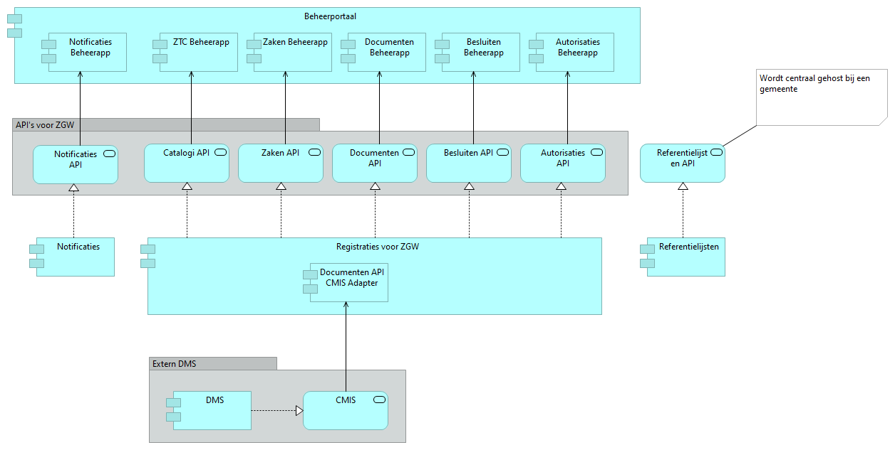

# Open Zaak

*Production-ready APIs for case management (zaakgericht werken).*

[Read this in Dutch](readme.rst).

| | | |
|-|-|-|
| **Version:** | 1.3.2 |
| **Source:** | https://github.com/open-zaak/open-zaak |
| **Keywords:** | zaken, zaakgericht werken, zaken-api, catalogi-api, besluiten-api, documenten-api |
| **PythonVersion:** | 3.7 |

This repository contains source code and documentation for production-ready APIs for case management. These APIs implement the VNG Realisatie Standard APIs for Case Management (zaakgericht werken).

## Case management

Case management is a form of process-oriented working that is used by Dutch municipalities, and increasingly national governments, to deal with requests from citizens. A case is a coherent amount of work with a defined trigger and a defined result, the quality and processing time of which must be monitored. The Case Management APIs support the registration of all metadata and data involved in case management. See also the VNG's [Case management in the municipal data landscape](https://www.gemmaonline.nl/images/gemmaonline/f/f6/20190620_-_Zaakgericht_werken_in_het_Gemeentelijk_Gegevenslandschap_v101.pdf) (in Dutch).

## Standard 'APIs for case management'

VNG Realisatie developed this standard within the Common Ground framework. Along with API specifications, reference implementations were created to demonstrate that the specifications can be implemented in software. The following substantive APIs are part of the standard:

- Catalogues - for the registration of case type catalogues, case type and all associated types.
- Cases - for the registration of cases. Cases can have relationships with documents, decisions and contacts (among others). The API includes audit trail and archiving functionality.
- Documents - for the registration of information objects, which can be both documents and other information carriers such as photos and film.
- Decisions - for the registration of decisions taken in the context of case management.
- Customer Interactions - these APIs support the registration of Contact Moments and Requests. Requests have a relationship with products and services from the PDC and can lead to cases.

In addition, there are a few generic APIs that are required to use these APIs:

- Notifications - in Common Ground, data is registered and maintained at the source. Consumers are not automatically notified when something has changed. Instead, they can subscribe to the Notifications API.
- Authorizations - application access to data is controlled via the Authorizations API.

## Production-ready APIs

When creating production-ready APIs, explicit attention was paid to performance scalability and component documentation. For this reason, the APIs for Case Management have largely been housed in one component with a single database.

Docker containers and a VM image are also available. This allows municipalities to easily run the APIs (or have them run) with a hosting party.

## Architecture of Open Zaak

The architecture of Open Zaak is based on a limited number of components. The most important component is the registration component offered by the APIs for Case Management. There are also the following components:

- Notification component that offers Notifications API
- Reference lists component used to unlock the selection list for archiving
- Management portal providing access to the various management apps associated with the APIs

## Implementation

This repository contains the source code for the APIs. In order to use the APIs, they must be hosted somewhere as a service. As part of the development process, with each new version of Open Zaak a Docker container that can be rolled out directly in a Kubernetes cluster is also created. An application VM image is also created. In a diagram, the hosting of in a Kubernetes looks like this:

## Links

- [VNG Standard APIs for Case Management](https://github.com/VNG-Realisatie/gemma-zaken)
- [Documentation](https://open-zaak.readthedocs.io/en/latest/)
- [Docker Hub](https://hub.docker.com/u/openzaak)

## Construction

These APIs have been developed by Maykin Media B.V. on behalf of Amsterdam, Rotterdam, Utrecht, Tilburg, Arnhem, Haarlem, 's-Hertogenbosch, SED, Delft and Hoorn under the direction of Dimpact.

OpenZaak is in incubation [codebase stewardship](https://publiccode.net/codebase-stewardship/) with the [Foundation for Public Code](https://publiccode.net).

## License

Licensed under the [EUPL](LICENSE.md).
