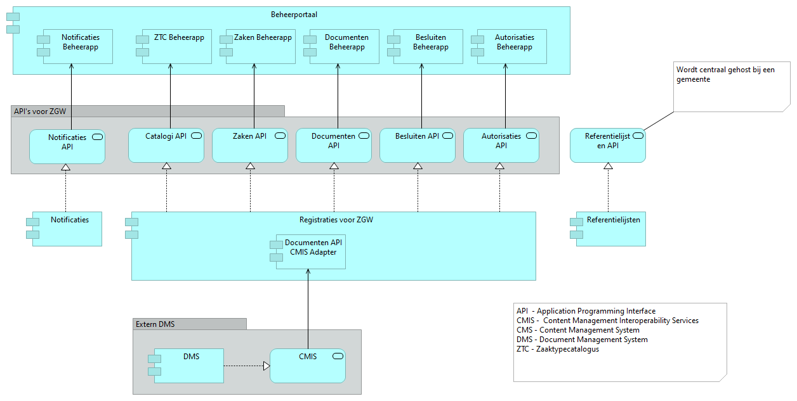
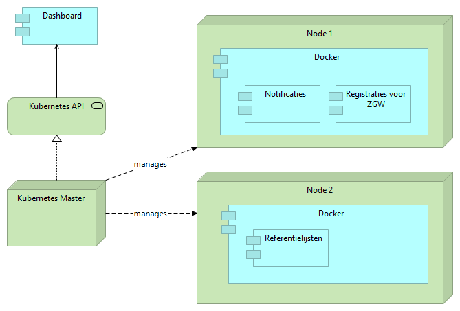

=========
OpenZaak - productiewaardige API's voor Zaakgericht Werken
=========

:Version: 1.0.1
:Source: https://github.com/open-zaak/open-zaak
:Keywords: zaken, zaakgericht werken, zaken-api, catalogi-api, besluiten-api, documenten-api
:PythonVersion: 3.7

|build-status| |docs| |coverage| |black| |docker|

Deze repository bevat broncode en documentatie voor productiewaardige API's voor Zaakgericht Werken (ZGW). Deze API's volgen de standaard van VNG Realisatie "API's voor Zaakgericht Werken".

Zaakgericht Werken
=========

Zaakgericht werken is een vorm van procesgericht werken die door de Nederlandse gemeenten, en steeds meer landelijke overheden, wordt toegepast om verzoeken van burgers te behandelen. De zaak staat hierbij centraal. Een zaak is een samenhangende hoeveelheid werk met een gedefinieerde aanleiding en een gedefinieerd resultaat waarvan kwaliteit en doorlooptijd bewaakt moeten worden. De API's voor Zaakgericht Werken ondersteunen de registratie van alle metadata en gegevens die komen kijken bij Zaakgericht Werken.

Standaard "API's voor Zaakgericht Werken"
=========

In het kader van Common Ground heeft VNG Realisatie deze standaard ontwikkeld. Daarbij zijn tegelijk met API-specificaties referentie-implementaties gerealiseerd om aan te tonen dat de specificaties in software kunnen worden geïmplementeerd. De volgende inhoudelijke API's maken onderdeel uit van de standaard:

* Catalogi - voor de registratie van zaaktype-catalogi, zaaktype en alle daarbij horende typen.
* Zaken - voor de registratie van zaken. Zaken kunnen o.a. relaties hebben met documenten, besluiten, contacten. De API biedt functionaliteit voor audit trail en archiveren.
* Documenten - voor de registratie van informatieobjecten, hetgeen zowel documenten als andere informatiedragers zoals foto's en film kunnen zijn.
* Besluiten - voor de registratie van besluiten die in het kader van zaakgericht werken worden genomen.
* Klantinteracties - deze API ondersteunt de registratie van Contactmomenten en Verzoeken. Verzoeken hebben een relatie met producten en diensten uit de Producten Diensten Catalogus (PDC) en kunnen leiden tot zaken. Deze API wordt op een later moment toegevoegd aan OpenZaak.

Daarnaast zijn er een paar generieke API's die nodig om gebruik te maken van deze API's:

* Notificaties - in Common Ground worden gegevens bij de bron geregistreerd en bijgehouden. Consumers krijgen niet vanzelf bericht als er iets is gewijzigd. Hiervoor kunnen ze een abonnement registreren bij de Notificaties API.
* Autorisaties - via de Autorisaties API wordt de toegang van applicaties tot gegevens geregeld.

Productiewaardige API's
==========

Bij de realisatie van productiewaardige API's is aandacht besteed aan een aantal belangrijke aspecten:

* Beheer: er is een beheerportaal ingericht waarmee de verschillende API's door functioneel beheerders kunnen worden beheerd.
* Performance: er zijn performance-metingen verricht op basis van schattingen van de verwachte belasting door applicaties die eindgebruikers gebruiken. Benodigde verbeteringen zijn doorgevoerd waardoor een belasting door 2000 eindgebruikers geen problemen zou moeten opleveren.
* Documentatie van de componenten, met name van de beheer applicaties.
* Uitrol: Om de uitrol naar servers te vereenvoudigen zijn er Docker containers en een Virtual Machine (VM) image beschikbaar. Dit zijn een soort componenten die gemakkelijk kunnen worden uitgerold op een server om ze vervolgens in gebruik te nemen. Hiermee kunnen gemeenten de API’s op eenvoudige wijze (laten) draaien bij een hostingpartij.

Architectuur van OpenZaak
===========

De architectuur van OpenZaak is gebaseerd op een beperkt aantal componenten. De belangrijkste component is de registratiecomponent die de API's voor ZGW aanbiedt. Daarnaast zijn er de volgende componenten:

* Notificatie-component die Notificaties API aanbiedt
* Referentielijsten component die wordt gebruikt om de selectielijst voor archiveren te ontsluiten
* Beheerportaal dat toegang biedt tot de verschillende beheerapps die bij de API's horen

Implementatie
=========

Deze repository bevat de broncode voor de API's. Om gebruik te kunnen maken van de API's moeten deze ergens gehost worden als een service. Als onderdeel van de ontwikkelstraat worden bij elke nieuwe versie van OpenZaak containers voor Docker gecreëerd die direct kunnen worden uitgerold in een Kubernetes cluster. Ook wordt er een applicatie VM image gecreëerd. In een diagram ziet de hosting van in een Kubernetes cluster als volgt uit:

Links
=====

* `Standaard`_
* `Documentatie`_
* `Docker Hub`_

.. _`Documentatie`: https://open-zaak.readthedocs.io/en/latest/
.. _`Docker Hub`: https://hub.docker.com/u/openzaak
.. _`Standaard`: https://github.com/VNG-Realisatie/gemma-zaken

Bouw
========

Deze API's zijn ontwikkeld door `Maykin Media B.V.`_ in opdracht van Amsterdam,
Rotterdam, Utrecht, Tilburg, Arnhem, Haarlem, 's-Hertogenbosch, Delft en Hoorn,
Medemblik, Stede Broec, Drechteland, Enkhuizen (SED), onder regie van
`Dimpact`_.

.. _Maykin Media B.V.: https://www.maykinmedia.nl
.. _Dimpact: https://www.dimpact.nl

Licentie
========

Licensed under the EUPL_

.. _EUPL: LICENSE.md

.. |build-status| image:: https://travis-ci.org/open-zaak/open-zaak.svg?branch=master
    :alt: Build status
    :target: https://travis-ci.org/open-zaak/open-zaak

.. |docs| image:: https://readthedocs.org/projects/open-zaak/badge/?version=latest
    :target: https://open-zaak.readthedocs.io/en/latest/?badge=latest
    :alt: Documentation Status

.. |coverage| image:: https://codecov.io/github/open-zaak/open-zaak/branch/master/graphs/badge.svg?branch=master
    :alt: Coverage
    :target: https://codecov.io/gh/open-zaak/open-zaak

.. |black| image:: https://img.shields.io/badge/code%20style-black-000000.svg
    :target: https://github.com/psf/black

.. |docker| image:: https://images.microbadger.com/badges/image/openzaak/open-zaak.svg
    :target: https://microbadger.com/images/openzaak/open-zaak
