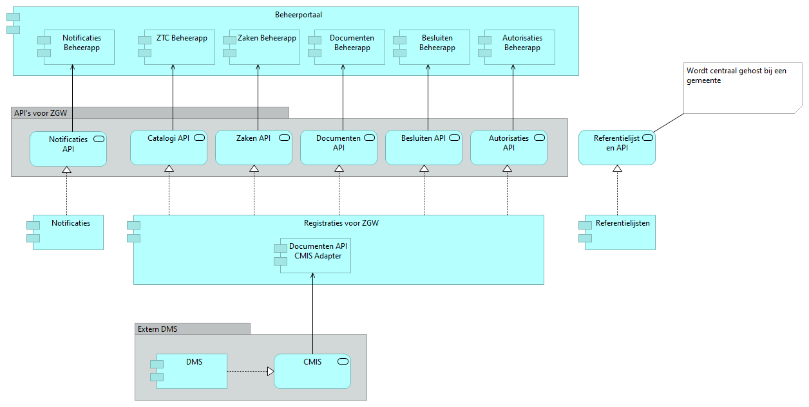

=========
Open Zaak
=========

.. image:: https://raw.githubusercontent.com/open-zaak/open-zaak/refs/heads/main/.github/assets/open-zaak-logo.svg
    :height: 100px
    :alt: Open Zaak

*Production-ready APIs for Case-Oriented Working*

`Read this in Dutch`_

.. _`Read this in Dutch`: README.NL.rst

:Version: 1.29.1
:Source: https://github.com/open-zaak/open-zaak
:Keywords: zaken, zaakgericht werken, zaken-api, catalogi-api, besluiten-api, documenten-api
:PythonVersion: 3.12

|build-status| |docs| |coverage| |code-quality| |ruff| |docker| |docker| |python-version|

This repository contains source code and documentation for production-ready APIs for Case-Oriented Working (ZGW).
These APIs adhere to the VNG Realisatie standard "APIs for Case-Oriented Working" (API's voor Zaakgericht Werken).

Case-oriented working
=====================

Case-oriented working is a form of process-oriented working adopted by Dutch municipalities, and
increasingly by national government bodies, to handle requests from citizens and businesses.
The "case" is central to this approach. A case is a coherent body of work with a defined trigger and a
defined outcome, requiring the monitoring of both quality and turnaround time. The APIs for Case-Oriented
Working support the registration of all metadata and data associated with this way of working.
See also `Case-oriented working in the municipal data landscape`_.

.. _`Case-oriented working in the municipal data landscape`: https://www.gemmaonline.nl/images/gemmaonline/f/f6/20190620_-_Zaakgericht_werken_in_het_Gemeentelijk_Gegevenslandschap_v101.pdf

Standard "APIs for Case-Oriented Working"
=========================================

* Catalogi (Catalogs) - for registering case type catalogs, case types, and all associated types.
* Zaken (Cases) - for registering cases. Cases can be linked to items such as documents, decisions, and contacts.
  The API provides functionality for audit trails and archiving.
* Documenten (Documents) - for registering information objects, which can include documents as well as other
  information carriers such as photos and film.
* Besluiten (Decisions) - for registering decisions made within the context of case-oriented working.

In addition, there are a few generic APIs required to use these APIs:

* Notifications - in Common Ground, data is registered and maintained at the source.
  Consumers are not automatically notified when changes occur; to receive updates,
  they can register a subscription with the Notifications API.
* Authorizations - the Authorizations API manages application access to data.

Production-ready APIs
=====================

In developing production-ready APIs, attention was paid to several key aspects:

* Management: A management portal has been set up to allow functional administrators to manage the various APIs.
* Performance: Performance measurements were conducted based on estimated loads from end-user applications.
  Necessary improvements were implemented to ensure that a load generated by 2,000 end-users should not cause issues.
* Documentation of the components, particularly the management applications. (Documentation regarding
  the APIs themselves is part of the standard.)
* Deployment: A Docker image is available to simplify deployment to servers. These containers are
  components that can be easily deployed to a server and put into operation. This enables municipalities to
  easily run the APIs—or have them hosted—by a hosting provider.

Architecture of Open Zaak
=========================

The architecture of Open Zaak is based on a limited number of components. The most important
component is the registration component, which provides the APIs for ZGW. In addition,
there are the following components:

* Notification component, necessary for the operation of Open Zaak.
* Selection list component, which is used to provide access to the VNG Selection List (Selectielijst) for archiving.
* Management portal, which provides access to the various management apps associated with the APIs.

Implementation
==============

This repository contains the source code for the APIs. To use the APIs, they must be hosted
somewhere as a service. As part of the development pipeline, with every new version of Open Zaak,
a Docker image is built that can be deployed directly to a Kubernetes cluster.

Deze repository bevat de broncode voor de API's. Om gebruik te kunnen maken van de API's moeten
deze ergens gehost worden als een service. Als onderdeel van de ontwikkelstraat worden bij elke
nieuwe versie van Open Zaak een Docker container die direct kunnen worden uitgerold in een Kubernetes cluster.

Links
=====

* `VNG standard APIs voor Zaakgericht Werken`_
* `Documentation`_
* `Docker Hub`_

.. _`Documentation`: https://open-zaak.readthedocs.io/en/latest/
.. _`Docker Hub`: https://hub.docker.com/u/openzaak
.. _`VNG standard APIs voor Zaakgericht Werken`: https://github.com/VNG-Realisatie/gemma-zaken

Development
===========

These APIs were developed by `Maykin B.V.`_ commissioned by Amsterdam,
Rotterdam, Utrecht, Tilburg, Arnhem, Haarlem, 's-Hertogenbosch, Delft and a coalition
of Hoorn, Medemblik, Stede Broec, Drechteland, Enkhuizen (SED), under the direction of `Dimpact`_.

.. _Maykin B.V.: https://www.maykin.nl
.. _Dimpact: https://www.dimpact.nl

License
=======

Licensed under the EUPL_

.. _EUPL: LICENSE.md

.. |build-status| image:: https://github.com/open-zaak/open-zaak/actions/workflows/ci.yml/badge.svg?branch=main
    :alt: Build status
    :target: https://github.com/open-zaak/open-zaak/actions/workflows/ci.yml

.. |code-quality| image:: https://github.com/open-zaak/open-zaak/actions/workflows/code_quality.yml/badge.svg?branch=main
     :alt: Code quality checks
     :target: https://github.com/open-zaak/open-zaak/actions/workflows/code_quality.yml

.. |docs| image:: https://readthedocs.org/projects/open-zaak/badge/?version=latest
    :target: https://open-zaak.readthedocs.io/en/latest/?badge=latest
    :alt: Documentation Status

.. |coverage| image:: https://codecov.io/gh/open-zaak/open-zaak/graph/badge.svg?token=1ggPK0Ffg2
    :alt: Coverage
    :target: https://codecov.io/gh/open-zaak/open-zaak

.. |ruff| image:: https://img.shields.io/endpoint?url=https://raw.githubusercontent.com/astral-sh/ruff/main/assets/badge/v2.json
    :target: https://github.com/astral-sh/ruff
    :alt: Ruff

.. |python-version| image:: https://img.shields.io/badge/python-3.12-blue.svg
    :alt: Supported Python version

.. |docker| image:: https://img.shields.io/docker/image-size/openzaak/open-zaak
    :target: https://hub.docker.com/r/openzaak/open-zaak
