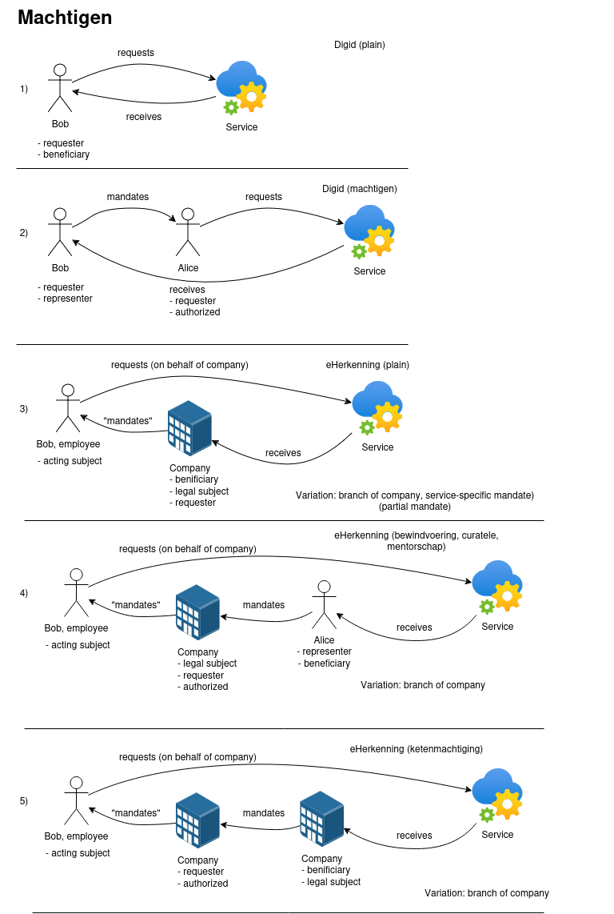

.. _client-development-mandate:

Registering and querying cases created on behalf of another party
=================================================================

.. note::
    This is an experimental feature and it doesn't rely on existing ZGW standards.

Cases for an entity (like a person or a company, the beneficiary) can be initiated and managed by other
parties, such as individuals (voluntary mandate), organizations (voluntary or forced mandate) or
municipality employees assisting. The ``Rol`` resource in the Zaken API is used to record the details
of this other party acting on behalf of the beneficiary.

In such scenarios, the user authenticates with DigiD or eHerkenning in an application. They can
do this for themselves, or represent another entity. The application where they authenticate creates
(or reads/updates) the case and adds this *authentication context* to the case via 
``Rol.authenticatieContext`` to persist the meta information about the authentication and mandate itself.

DigiD and eHerkenning both support mandates, albeit in different flavours.

The image above describes some typical scenarios involving mandates:

1. An individual (``natuurlijk_persoon``) is authorized with Digid and starts a case for themselves.
2. An individual (``natuurlijk_persoon``) is authorized with DigiD and starts a case on
   behalf of another individual (DigiD Machtigen).
3. An employee of a company/organisation (``niet_natuurlijk_persoon`` or ``vestiging``) has an *eHerkenningsmiddel*
   which allows them to start a case for their company/organisation. Legally, the company/organisation is liable,
   not the employee.
4. An employee of a company/organisation (``niet_natuurlijk_persoon`` or ``vestiging``) has an *eHerkenningsmiddel*
   for their company/organisation. This company/organisation represents an individual, and the employee can start a
   case for the individual. Legally, the company/organisation is liable, not the employee.
5. An employee of the company/organization (``niet_natuurlijk_persoon`` or ``vestiging``) has an *eHerkenningsmiddel*
   for their company/organisation. This company/organisation represents another company, and the employee can start a
   case for the other company (eHerkenning ketenmachtiging). Legally, the company/organisation is liable, not
   the employee.

In Open Zaak, the API endpoint ``/zaken/api/v1/rollen`` has experimental support for these scenarios. You can find examples on how to use these below.

Recipes for "rollen" with mandates
----------------------------------

General rules
^^^^^^^^^^^^^

* all information about mandates is stored in ``Rol.authenticatieContext``
* mandates are supported only for the ``natuurlijk_persoon``, ``niet_natuurlijk_persoon`` and
  ``vestiging`` values of ``Rol.betrokkeneType``
* only ``digid`` and ``eherkenning`` are supported as sources for mandates
* an authorizee (``gemachtigde``) and a representee (``machtiginggever``) are defined by
  ``Rol.indicatieMachtiging`` attribute. If it's blank, that means that the party initiates
  their own case.
* for eHerkenning cases, the employee details should be added to ``Rol.contactpersoonRol``
  attributes.

Validation rules
^^^^^^^^^^^^^^^^

* if ``representee`` is provided in ``authenticatieContext``, then:
    * ``indicatieMachtiging`` **MUST** be set to "gemachtigde"
    * ``mandate`` **MUST** be provided in the ``authenticatieContext``

* if ``betrokkeneType`` is ``natuurlijk_persoon``, then ``Rol.authenticatieContext.source``
  **MUST** be set to "digid"

* if ``betrokkeneType`` is ``niet_natuurlijk_persoon`` or ``vestiging``, then
  ``Rol.authenticatieContext.source`` **MUST** be set to "eherkenning"

Example API calls below are provided with required fields and dummy data, the focus is on the shape of
``authenticatieContext``.

1. DigiD / Without mandate
^^^^^^^^^^^^^^^^^^^^^^^^^^

**DigiD - initiator**

.. code:: http

    POST /zaken/api/v1/rollen HTTP/1.1
    Content-Type: application/json

    {
        "zaak": "http://example.com",
        "betrokkeneType": "natuurlijk_persoon",
        "roltype": "http://example.com/roltype-initiator",
        "roltoelichting": "Created zaak",
        "betrokkeneIdentificatie": {
            "inpBsn": "123456782"
        },
        "authenticatieContext": {
            "source": "digid",
            "levelOfAssurance": "urn:oasis:names:tc:SAML:2.0:ac:classes:MobileTwoFactorContract"
        }
    }

2. DigiD / With mandate
^^^^^^^^^^^^^^^^^^^^^^^

**DigiD - initiator**

The authorizee is the "initiator" of the case, the representee
is a "belanghebbende".

.. code:: http

    POST /zaken/api/v1/rollen HTTP/1.1
    Content-Type: application/json

    {
        "zaak": "http://example.com",
        "betrokkeneType": "natuurlijk_persoon",
        "roltype": "http://example.com/roltype-initiator",
        "roltoelichting": "Created zaak",
        "indicatieMachtiging": "gemachtigde",
        "betrokkeneIdentificatie": {
            "inpBsn": "123456782"
        },
        "authenticatieContext": {
            "source": "digid",
            "levelOfAssurance": "urn:oasis:names:tc:SAML:2.0:ac:classes:MobileTwoFactorContract"
            "representee": {
                "identifierType": "bsn",
                "identifier": "111222333"
            },
            "mandate": {
                "services": [
                    {"id": "5628edbd-333e-460d-8a69-8f083b8cf1b8"}
                ]
            }
        }
    }

**DigiD - belanghebbende**

.. code:: http

    POST /zaken/api/v1/rollen HTTP/1.1
    Content-Type: application/json

    {
        "zaak": "http://example.com",
        "betrokkeneType": "natuurlijk_persoon",
        "roltype": "http://example.com/roltype-belanghebbende",
        "roltoelichting": "Beneficiary",
        "indicatieMachtiging": "machtiginggever",
        "betrokkeneIdentificatie": {
            "inpBsn": "111222333"
            },
        "authenticatieContext": null
    }

3. eHerkenning / Without mandate
^^^^^^^^^^^^^^^^^^^^^^^^^^^^^^^^

**eHerkenning - initiator (no branch)**

.. code:: http

    POST /zaken/api/v1/rollen HTTP/1.1
    Content-Type: application/json

    {
        "zaak": "http://example.com",
        "betrokkeneType": "niet_natuurlijk_persoon",
        "roltype": "http://example.com/roltype-initiator",
        "roltoelichting": "Created zaak",
        "contactpersoonRol": {
            "naam": "acting subject name"
        },
        "betrokkeneIdentificatie": {
            "innNnpId": "999999999"
        },
        "authenticatieContext": {
            "source": "eherkenning",
            "levelOfAssurance": "urn:etoegang:core:assurance-class:loa2plus",
            "actingSubject": "4B75A0EA107B3D36C82FD675B5B78CC2F181B22E33D85F2D4A5DA63452EE3018@2D8FF1EF10279BC2643F376D89835151"
        }
    }

**eHerkenning - initiator (branch)**

.. code:: http

    POST /zaken/api/v1/rollen HTTP/1.1
    Content-Type: application/json

    {
        "zaak": "http://example.com",
        "betrokkeneType": "vestiging",
        "roltype": "http://example.com/roltype-initiator",
        "roltoelichting": "Created zaak",
        "contactpersoonRol": {
            "naam": "acting subject name"
        },
        "betrokkeneIdentificatie": {
            "kvkNummer": "12345678",
            "vestigingsNummer": "123456789012"
        },
        "authenticatieContext": {
            "source": "eherkenning",
            "levelOfAssurance": "urn:etoegang:core:assurance-class:loa2plus",
            "actingSubject": "4B75A0EA107B3D36C82FD675B5B78CC2F181B22E33D85F2D4A5DA63452EE3018@2D8FF1EF10279BC2643F376D89835151"
        }
    }

4. eHerkenning / With mandate (bewindvoering)
^^^^^^^^^^^^^^^^^^^^^^^^^^^^^^^^^^^^^^^^^^^^^

.. note:: This shape also applies to roles `curator` and `mentor`.

**eHerkenning - initiator**

.. code:: http

    POST /zaken/api/v1/rollen HTTP/1.1
    Content-Type: application/json

    {
        "zaak": "http://example.com",
        "betrokkeneType": "vestiging",
        "roltype": "http://example.com/roltype-initiator",
        "roltoelichting": "Created zaak",
        "contactpersoonRol": {
            "naam": "acting subject name"
        },
        "indicatieMachtiging": "gemachtigde",
        "betrokkeneIdentificatie": {
            "kvkNummer": "12345678",
            "vestigingsNummer": "123456789012"
        },
        "authenticatieContext": {
            "source": "eherkenning",
            "levelOfAssurance": "urn:etoegang:core:assurance-class:loa2plus",
            "representee": {
                "identifierType": "bsn",
                "identifier": "111222333"
            },
            "actingSubject": "4B75A0EA107B3D36C82FD675B5B78CC2F181B22E33D85F2D4A5DA63452EE3018@2D8FF1EF10279BC2643F376D89835151",
            "mandate": {
                "role": "bewindvoerder",
                "services": [{
                    "id": "urn:etoegang:DV:00000001002308836000:services:9113",
                    "uuid": "34085d78-21aa-4481-a219-b28d7f3282fc"
                }]
            }
        }
    }

**eHerkenning - belanghebbende**

.. code:: http

    POST /zaken/api/v1/rollen HTTP/1.1
    Content-Type: application/json

    {
        "zaak": "http://example.com",
        "betrokkeneType": "natuurlijk_persoon",
        "roltype": "http://example.com/roltype-belanghebbende",
        "roltoelichting": "Persoon waarover bewind gevoerd wordt",
        "indicatieMachtiging": "machtiginggever",
        "betrokkeneIdentificatie": {
            "inpBsn": "111222333"
        },
        "authenticatieContext": null
    }

5. eHerkenning / With mandate (ketenmachtiging)
^^^^^^^^^^^^^^^^^^^^^^^^^^^^^^^^^^^^^^^^^^^^^^^

.. warning::
   For "ketenmachtiging" only KVK nummers are supported by eHerkenning. Therefore
   it's not possible to use the branch ("vestiging") identified by `vestigingsNummer`

**eHerkenning - initiator**

.. code:: http

    POST /zaken/api/v1/rollen HTTP/1.1
    Content-Type: application/json

    {
        "zaak": "http://example.com",
        "betrokkeneType": "niet_natuurlijk_persoon",
        "roltype": "http://example.com/roltype-initiator",
        "roltoelichting": "Created zaak",
        "contactpersoonRol": {
            "naam": "acting subject name"
        },
        "indicatieMachtiging": "gemachtigde",
        "betrokkeneIdentificatie": {
            "kvkNummer": "12345678",
        },
        "authenticatieContext": {
        "source": "eherkenning",
        "levelOfAssurance": "urn:etoegang:core:assurance-class:loa2plus",
        "representee": {
            "identifierType": "kvkNummer",
            "identifier": "99998888"
        },
        "actingSubject": "4B75A0EA107B3D36C82FD675B5B78CC2F181B22E33D85F2D4A5DA63452EE3018@2D8FF1EF10279BC2643F376D89835151",
        "mandate": {
            "services": [{
                "id": "urn:etoegang:DV:00000001002308836000:services:9113",
                "uuid": "34085d78-21aa-4481-a219-b28d7f3282fc"
            }]
            }
        }
    }

**eHerkenning - belanghebbende**

.. code:: http

    POST /zaken/api/v1/rollen HTTP/1.1
    Content-Type: application/json

    {
        "zaak": "http://example.com",
        "betrokkeneType": "niet_natuurlijk_persoon",
        "roltype": "http://example.com/roltype-belanghebbende",
        "roltoelichting": "Bedrijf dat de intermediair machtigt",
        "indicatieMachtiging": "machtiginggever",
        "betrokkeneIdentificatie": {
            "kvkNummer": "99998888"
        },
        "authenticatieContext": null
    }

Query patterns
--------------

Below are examples how to request zaken, authorized by different parties.

**DigiD**

1. Show me my cases (based on my BSN) opened for myself:

    .. code::

        GET /zaken/api/v1/zaken?
             rol__betrokkeneIdentificatie__natuurlijkPersoon__inpBsn=<own_bsn>
             &rol__machtiging=eigen

    Additionally ``rol.omschrijvingGeneriek`` can be used to determine the "initiator"
    of the case.

    .. code::

        GET /zaken/api/v1/zaken?
             rol__betrokkeneIdentificatie__natuurlijkPersoon__inpBsn=<own_bsn>
             &rol__machtiging=eigen
             &rol__omschrijvingGeneriek=initiator

2. Show me my cases (based on my BSN) opened by an authorizee on my behalf:

    .. code::

        GET /zaken/api/v1/zaken?
             rol__betrokkeneIdentificatie__natuurlijkPersoon__inpBsn=<representee_bsn>
             &rol__machtiging=machtiginggever

    Additionally ``rol.omschrijvingGeneriek`` can be used to determine the "belanghebbende"
    of the case.

    .. code::

        GET /zaken/api/v1/zaken?
             rol__betrokkeneIdentificatie__natuurlijkPersoon__inpBsn=<representee_bsn>
             &rol__omschrijvingGeneriek=belanghebbende

3. Show me the cases (based on my BSN) where I represent another party:

    .. code::

        GET /zaken/api/v1/zaken?
             rol__betrokkeneIdentificatie__natuurlijkPersoon__inpBsn=<own_bsn>
             &rol__machtiging=gemachtigde

    It's also possible to filter cases based on the level of assurance and to exclude
    results where levelOfAssurance is higher (=more strict) than some required reference value. The example
    below excludes cases that were created in a "DigiD Substantieel" or "DigiD Hoog" authentication context,
    but returns cases for "DigiD Basis" and "DigiD Midden".

    .. code::

        GET /zaken/api/v1/zaken?
             rol__betrokkeneIdentificatie__natuurlijkPersoon__inpBsn=<own_bsn>
             &rol__machtiging=gemachtigde
             &rol__machtiging__loa=urn:oasis:names:tc:SAML:2.0:ac:classes:MobileTwoFactorContract

**eHerkenning**

Filters for eHerkenning authorized parties depend if it's an organization or the branch, therefore
there are two examples for each option.

1. Show me my cases (based on my KVK nummer) opened for myself:

    .. code::

        # organization
        GET /zaken/api/v1/zaken?
             rol__betrokkeneIdentificatie__nietNatuurlijkPersoon__kvk_Nummer=<own_kvk>
             &rol__machtiging=eigen

    .. code::

        # branch
        GET /zaken/api/v1/zaken?
             rol__betrokkeneIdentificatie__vestiging__kvkNummer=<own_kvk>
             &rol__betrokkeneIdentificatie__vestiging__vestigingsNummer=<own_vestigings_nummer>
             &rol__machtiging=eigen

    For organizations it's also possible to filter on their RSIN:

    .. code::

        GET /zaken/api/v1/zaken?
             rol__betrokkeneIdentificatie__nietNatuurlijkPersoon__innNnpId=<own_rsin>
             &rol__machtiging=eigen

    Additionally ``rol.omschrijvingGeneriek`` can be used to determine the "initiator"
    of the case

    .. code::

        GET /zaken/api/v1/zaken?
             rol__betrokkeneIdentificatie__nietNatuurlijkPersoon__kvk_Nummer=<own_kvk>
             &rol__machtiging=eigen
             &rol__omschrijvingGeneriek=initiator

2. Show me my cases (based on my KVK nummer) opened by an authorizee on my behalf:

    .. code::

        # organization
        GET /zaken/api/v1/zaken?
             rol__betrokkeneIdentificatie__nietNatuurlijkPersoon__kvk_Nummer=<representee_kvk_nummer>
             &rol__machtiging=machtiginggever

    Additionally ``rol.omschrijvingGeneriek`` can be used to determine the "belanghebbende"
    of the case.

    .. code::

        # organization
        GET /zaken/api/v1/zaken?
             rol__betrokkeneIdentificatie__nietNatuurlijkPersoon__kvk_Nummer=<representee_kvk>
             &rol__omschrijvingGeneriek=belanghebbende

    .. warning::
       For "ketenmachtiging" only KVK nummers are supported by eHerkenning. Therefore
       it's not possible to use the branch ("vestiging") identified by `vestigingsNummer`

3. Show me the cases (based on my KVK nummer) where I represent another party:

    .. code::

        # organization
        GET /zaken/api/v1/zaken?
             rol__betrokkeneIdentificatie__nietNatuurlijkPersoon__kvk_Nummer=<own_kvk>
             &rol__machtiging=gemachtigde

    .. code::

        # branch
        GET /zaken/api/v1/zaken?
             rol__betrokkeneIdentificatie__vestiging__kvkNummer=<own_kvk>
             &rol__betrokkeneIdentificatie__vestiging__vestigingsNummer=<own_vestigings_nummer>
             &rol__machtiging=gemachtigde

        It's also possible to filter cases based on the level of assurance and to exclude
        results where levelOfAssurance is higher (=more strict) than some required reference value. The example
        below excludes cases that were created in a "eHerkenning Substantial (3)" or "eHerkenning High (4)"
        authentication context, but returns cases for "eHerkenning Low (2+)", "eHerkenning Low (2)" and
        "eHerkenning Non existent (1)".

    .. code::

        GET /zaken/api/v1/zaken?
             rol__betrokkeneIdentificatie__nietNatuurlijkPersoon__kvk_Nummer=<own_kvk>
             &rol__machtiging=gemachtigde
             &rol__machtiging__loa=urn:etoegang:core:assurance-class:loa2plus

**Filters for rollen**

It's also possible to make requests with such filters for ``zaken/api/v1/rollen`` endpoint
to retrieve details of the parties. For example, show me the rollen (based on my BSN) where I represent another party:

    .. code::

        GET /zaken/api/v1/rollen?
             betrokkeneIdentificatie__natuurlijkPersoon__inpBsn=<own_bsn>
             &machtiging=gemachtigde
             &machtiging__loa=urn:oasis:names:tc:SAML:2.0:ac:classes:MobileTwoFactorContract

Useful documentation
--------------------

* the shape of ``Rol.authenticatieContext`` is based on `datadefinities voor authenticatiecontext <https://dienstverleningsplatform.gitbook.io/platform-generieke-dienstverlening-public/patronen/vertegenwoordiging-en-machtiging/datadefinities>`_
* Clarifications on mandates for roles at `VNG Github <https://github.com/VNG-Realisatie/gemma-zaken/issues/2435>`_
* `Digid machtiging  <https://www.logius.nl/domeinen/toegang/digid-machtigen/documentatie/digid-machtigen-functionele-beschrijving>`_
* `eHerkenning ketenmachtiging <https://www.eherkenning.nl/nl/machtigen/ketenmachtiging>`_
