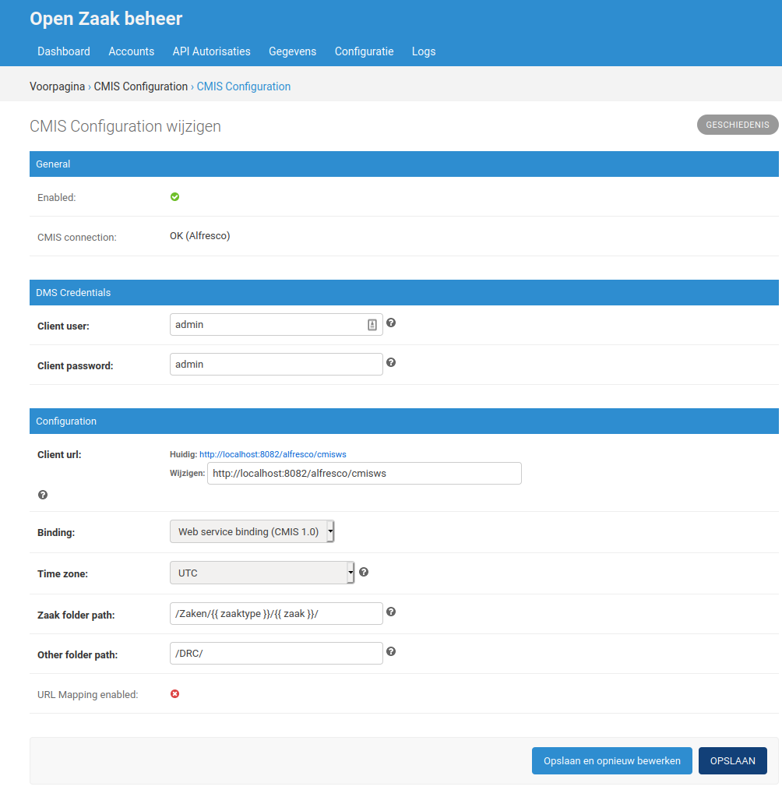

.. _installation_cmis:

CMIS adapter
============

In a default installation of Open Zaak, any documents created through the
`Documenten API`_ are stored on disk and their metadata is stored in the
database. However, it is also possible to store these documents in a Document
Management System (DMS) using the CMIS standard.

.. _`Documenten API`: https://documenten-api.vng.cloud/api/v1/schema/

The CMIS adapter converts API calls to the Documenten API in Open Zaak, to CMIS
calls which are sent to the DMS to retrieve, create, update and delete
documents. This way, the documents are stored in, or retrieved from, the DMS
and not in or from Open Zaak.

CMIS support
------------

`CMIS 1.0`_ and `CMIS 1.1`_ have various CMIS protocol bindings that can be
used. Although according to the CMIS specification repositories must implement
Web Services and AtomPub bindings, some DMS implementation only support one
and/or recommend the newer Browser bindings.

.. _`CMIS 1.0`: https://docs.oasis-open.org/cmis/CMIS/v1.0/cmis-spec-v1.0.html
.. _`CMIS 1.1`: https://docs.oasis-open.org/cmis/CMIS/v1.1/CMIS-v1.1.html

+----------------------+-----------+-----------+
|                      |  CMIS 1.0 |  CMIS 1.1 |
+======================+===========+===========+
| Web Services binding | Supported |  Untested |
+----------------------+-----------+-----------+
| AtomPub binding      |  Untested |  Untested |
+----------------------+-----------+-----------+
| Browser binding      |    N/A    | Supported |
+----------------------+-----------+-----------+

CMIS support is built in Open Zaak using the `CMIS adapter library`_. For an
up-to-date list of supported CMIS versions and libraries, please see this
project's documentation.

.. warning::
   The CMIS adapter is currently an experimental feature. While we have
   extensive unit test coverage with `Alfresco`_, we require more "real world"
   testing before we can label the feature as stable.

.. _`Alfresco`: https://www.alfresco.com/ecm-software/alfresco-community-editions

Using the CMIS adapter
----------------------

1. Create a mapping file to match Documenten API attributes to custom
   properties in your DMS model. The format is explained in the
   `CMIS adapter library`_ *Mapping configuration* documentation.

   You can use our `default CMIS mapping`_  for inspiration or just use these
   as defaults.

   .. _`default CMIS mapping`: https://github.com/open-zaak/open-zaak/blob/master/config/cmis_mapper.json
   .. _`Alfresco model`: https://github.com/open-zaak/open-zaak/blob/master/extension/alfresco-zsdms-model.xml

2. Make sure the content model is loaded in your DMS and matches the CMIS
   mapping described in step 1. It's important that all attributes are present.
   Some need to be indexed to allow the proper CMIS queries to be executed.

   You can use our `Alfresco model`_ that matches the default mapping. The
   detailed explanation is described in the `CMIS adapter library`_
   *DMS Content model configuration* documentation.

3. Enable the CMIS adapter. In the environment (or ``.env`` file), add or
   update the variable ``CMIS_ENABLED`` and ``CMIS_MAPPER_FILE``:

    .. code-block:: bash

        # Enables the CMIS-backend and the Open Zaak admin interface for configuring
        # the DMS settings.
        CMIS_ENABLED = True

        # Absolute path to the mapping of Documenten API attributes to (custom)
        # properties in your DMS model.
        CMIS_MAPPER_FILE = /path/to/cmis_mapper.json

4. You will need to restart Open Zaak for these changes to take effect.

5. Login to the Open Zaak admin interface (``/admin/``) as superuser.

6. Navigate to **Configuratie > CMIS configuration** and fill in all relevant
   fields.

7. Save the configuration with **Opslaan en opnieuw bewerken**.

8. You will see the **CMIS connection** status shows **OK** if everything went
   well.

.. _`CMIS adapter library`: https://github.com/open-zaak/cmis-adapter

When using the CMIS-adapter, sometimes a Zaak, a Zaaktype or a Besluit need to be retrieved from the APIs.
This happens for example when a Zaak folder is created, since the description of the Zaak is used as part of the folder name.

For this reason, the CMIS-adapter needs to be given access to the various APIs.
These are the steps to configure it:

1. Go to **API Autorisaties > Applicaties** and click on **Applicatie toevoegen**.

2. Fill out the form:

    a. **Client ID**: *For example:* ``cmis-adapter``

    b. **Secret**: *Some random string, for example:* ``Tl8@04&O4gXTtB``. You will need this later on!

3. Click **Opslaan en opnieuw bewerken**.

4. Click **Beheer Autorisaties**.

5. Under **Component** check ``Zaken API``, under **Selecteer scopes** check ``zaken.lezen``, under **Voor welke typen geldt dit?** check ``Alle huidige en toekomsitge ZAAKTYPEN`` and  under **Tot en met welke vertrouwelijkheidaanduiding?** check ``Zeer geheim``.

6. Click on **Nog Autorisaties toevoegen** and under **Component** check ``Catalogi API`` and under **Selecteer scopes** check ``catalogi.lezen``.

7. Click on **Nog Autorisaties toevoegen** and check under **Component** ``Besluiten API``, under **Selecteer scopes** check ``besluiten.lezen`` and under **Voor welke typen geldt dit?** check ``Alle huidige en toekomsitge BESLUITTYPEN``.

8. Click on **Nog Autorisaties toevoegen** and under **Component** check ``Documenten API``,  under **Selecteer scopes** check ``documenten.lezen``,  under **Voor welke typen geldt dit?** check ``Alle huidige en toekomsitge INFORMATIEOBJECTTYPEN`` and under **Tot en met welke vertrouwelijkheidaanduiding?** check ``Zeer geheim``.

9. Click on **Opslaan** to save.

Then, the services need to be configured.
First, configure the Zaken API as follows:

1. Go to **API Autorisaties > Services** and click on **Service Toevoegen**.

2. Fill out the form:

    a. The **API type** should be ``ZRC (Zaken)``.

    b. The **API root** could be ``http://example.com/zaken/api/v1/``.

    c. The **client ID** and the **secret** should be those configured in the **API Autorisaties > Applicaties**. Following the previous example, they would be ``cmis-adapter`` and ``Tl8@04&O4gXTtB`` respectively.

3. Click **Opslaan** to save.

Repeat the procedure above for the Zaaktypen API, Besluiten API and Documenten API.
Make sure to use the proper **Type** and **API root**. The credentials should all be the same.

Additional notes on creating documents
--------------------------------------

Depending on whether the CMIS adapter is enabled, there is a difference in behaviour for creating documents with an empty identification field.

If the CMIS adapter is disabled, the procedure to automatically generate the identification is as follows:

1. The prefix ``DOCUMENT`` is combined with the year of creation of the document. For example: ``DOCUMENT-2020-``
2. All existing documents are searched to find all those with an identification field that starts with the generated prefix. These would for example be ``DOCUMENT-2020-0000000001``, ``DOCUMENT-2020-0000000002``, ``DOCUMENT-2020-0000000003``.
3. The new document is given an identification field with a unique number that is different from those of all the other documents. This would for example be ``DOCUMENT-2020-0000000004``.

The search done in point 2. requires an SQL LIKE clause, which is not supported by all DMSs. For this reason, if the CMIS adapter is in use, the automatically generated identification field will be equal to the document UUID.
