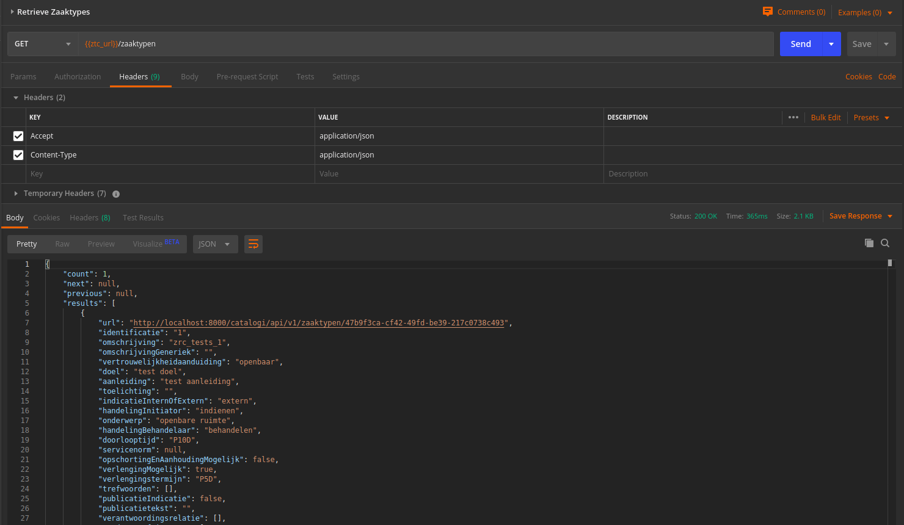

.. _installation_configuration:

=======================
Open Zaak configuration
=======================

Before you can work with Open Zaak after installation, a few settings need to be
configured first.

.. _installation_configuration_sites:

Setting the domain
==================

In the admin, under **Configuratie > Websites**, make sure to change the existing
``Site`` to the domain under which Open Zaak will be deployed (see
:ref:`the manual<manual_configuration>` for more information).

Configure Notificaties API
==========================

Next, the notifications for Open Zaak must be configured. We assume you're also
using Open Notificaties to make a complete setup.

There are 2 things to keep in mind:

1. Open Zaak offers an Autorisaties API and thus the Open Zaak Autorisaties API
   must be consulted to check for **autorisations**.
2. Each component handles **authentication** themselves and thus we need to store
   the Client IDs and secrets in each component that wants to communicate with
   eachother.

Open Zaak
---------

1. Configure the Notificaties API endpoint (so Open Zaak knows where to send
   notifications to):

   a. Navigate to **Configuratie > Notificatiescomponentconfiguratie**
   b. Fill out the form:

      - **API root**: *The URL to the Notificaties API. For example:*
        ``https://open-notificaties.gemeente.local/api/v1/``.

   c. Click **Opslaan**.

2. Configure the credentials for the Notificaties API (so Open Zaak can access
   the Notificaties API):

   a. Navigate to **API Autorisaties > Services**
   b. Click **Service toevoegen**.
   c. Fill out the form:

      - **Label**: *For example:* ``Open Notificaties``
      - **Type**: Select the option: ``NRC (Notifications)``
      - **API root url**: *Same URL as used in step 1b.*

      - **Client ID**: *For example:* ``open-zaak-backend``
      - **Secret**: *Some random string. You will need this later on!*
      - **Authorization type**: Select the option: ``ZGW client_id + secret``
      - **OAS**: URL that points to the OAS, same URL as used in step 1b with ``/schema/openapi.yaml`` added to it
        *for example:* ``https://open-notificaties.gemeente.local/api/v1/schema/openapi.yaml``
      - **User ID**: *Same as the Client ID*
      - **User representation**: *For example:* ``Open Zaak``

   d. Click **Opslaan**.

3. Since Open Zaak also manages the authorizations via the Autorisaties API, we
   need to give Open Notificaties access to this API (so Open Notificaties can
   see who's authorised to send notifications):

   a. Navigate to **API Autorisaties > Applicaties**
   b. Click **Applicatie toevoegen**.
   c. Fill out the form:

      - **Label**: *For example:* ``Open Notificaties``

      - **Client ID**: *For example:* ``open-notificaties``
      - **Secret**: *Some random string. You will need this later on!*

   d. Click **Opslaan en opnieuw bewerken**.
   e. Click **Beheer autorisaties**.
   f. Select component **Autorisaties API** and scope **autorisaties.lezen**.
   g. Click **Opslaan**

4. Finally, Open Notificaties will check if Open Zaak is allowed to send
   notifications (so we need to authorise Open Zaak for this):

   a. Navigate to **API Autorisaties > Applicaties**
   b. Click **Applicatie toevoegen**.
   c. Fill out the form:

      - **Label**: *For example:* ``Open Zaak``

      - **Client ID**: *For example:* ``open-zaak``
      - **Secret**: *Some random string*

   d. Click **Opslaan en opnieuw bewerken**.
   e. Click **Beheer autorisaties**.
   f. Select component **Notificaties API** and scopes
      **notificaties.consumeren** and **notificaties.publiceren**.
   g. Click **Opslaan**

Currently, Open Zaak does not require any webhook subscriptions. It will however
send notifications on various API actions.

We're not there yet! We need to configure Open Notificaties as well!

Open Notificaties
-----------------

1. Configure the Open Zaak Autorisaties API endpoint (so Open Notificaties
   knows where to check for the proper autorisations):

   a. Navigate to **Configuratie > Autorisatiecomponentconfiguratie**
   b. Fill out the form:

      - **API root**: *The URL to the Autorisaties API. For example:*
        ``https://open-zaak.gemeente.local/autorisaties/api/v1/``.
      - **Component**: ``Autorisatiecomponent``

   c. Click **Opslaan**.

2. Configure the credentials for the Open Zaak Autorisaties API (so Open
   Notificaties can access the Autorisaties API):

   a. Navigate to **API Autorisaties > Externe API credentials**
   b. Click **Externe API credential toevoegen**.
   c. Fill out the form:

      - **API root**: *Same URL as used in step 1b.*
      - **Label**: *For example:* ``Open Zaak``

      - **Client ID**: *The same Client ID as given in Open Zaak step 3c*
      - **Secret**: *The same Secret as given in Open Zaak step 3c*
      - **User ID**: *Same as the Client ID*
      - **User representation**: *For example:* ``Open Notificaties``

   d. Click **Opslaan**.

3. Finally, we need to allow Open Zaak to access Open Notificaties (for
   authentication purposes, so we can then check its authorisations):

   a. Navigate to **API Autorisaties > Client credentials**
   b. Click **Client credential toevoegen**.
   c. Fill out the form:

      - **Client ID**: *The same Client ID as given in Open Zaak step 2c*
      - **Secret**: *The same Secret as given in Open Zaak step 2c*

   d. Click **Opslaan**.

All done!

Create an API token
===================

By creating an API token, we can perform an API test call to verify the succesful
installation.

Navigate to **API Autorisaties** > **Applicaties** and click on **Applicatie toevoegen**
in the top right.

Give the application a label, such as ``test`` or ``demo``, and fill out a demo
``client ID`` and ``secret``. Next, click on **Opslaan en opnieuw bewerken** in the
bottom right. The application will be saved and you will see the same page again. Now,
click on **Beheer autorisaties** in the bottom right, which brings you to the
:ref:`authorization management<manual_api_app_auth>` for this application.

1. Select *Catalogi API* for the **Component** field
2. Check the ``catalogi.lezen`` checkbox
3. Click **Opslaan** in the bottom right

On the application detail page, you can now select and copy the JSON Web Token (JWT)
shown under **Client credentials**, which is required to make an API call.

.. warning::
   The JWT displayed here expires after a short time (1 hour by default) and should not
   be used in real applications. Applictions should use the ``client ID`` and ``secret``
   pair to generate JWT's on the fly.

Making an API call
==================

We can now make an HTTP request to one of the APIs of Open Zaak. For this example, we
have used `Postman`_ to make the request.

Make sure to set the value of the **Authorization** header to the JWT that was copied
in the previous step.

Then perform a GET request to the list display of ``ZaakTypen`` (Catalogi API) - this
endpoint is accessible at ``{{base_url}}/catalogi/api/v1/zaaktypen`` (where
``{{base_url}}`` is set to the domain configured in
:ref:`installation_configuration_sites`).

    A GET request to the Catalogi API using Postman

.. _Postman: https://www.getpostman.com/
