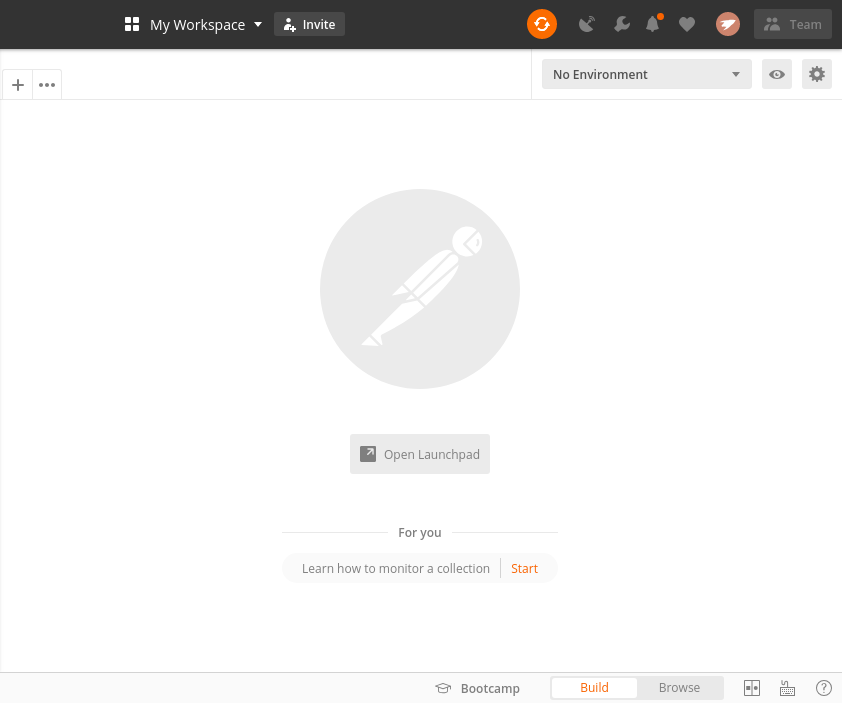
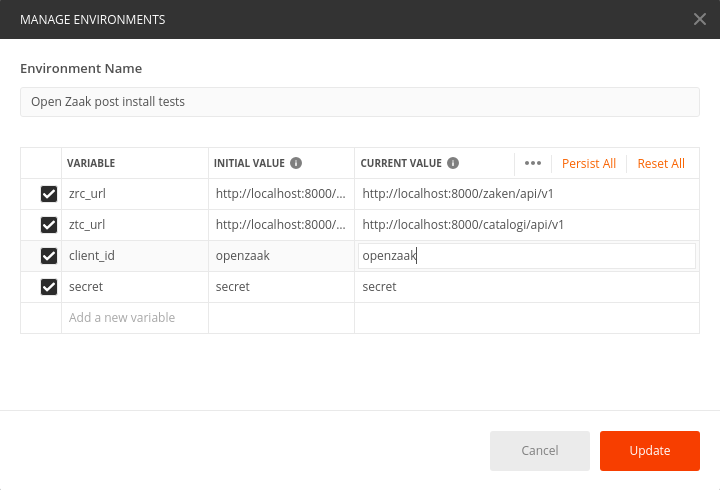
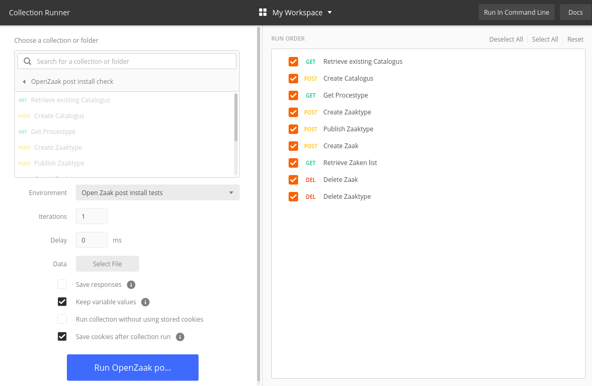
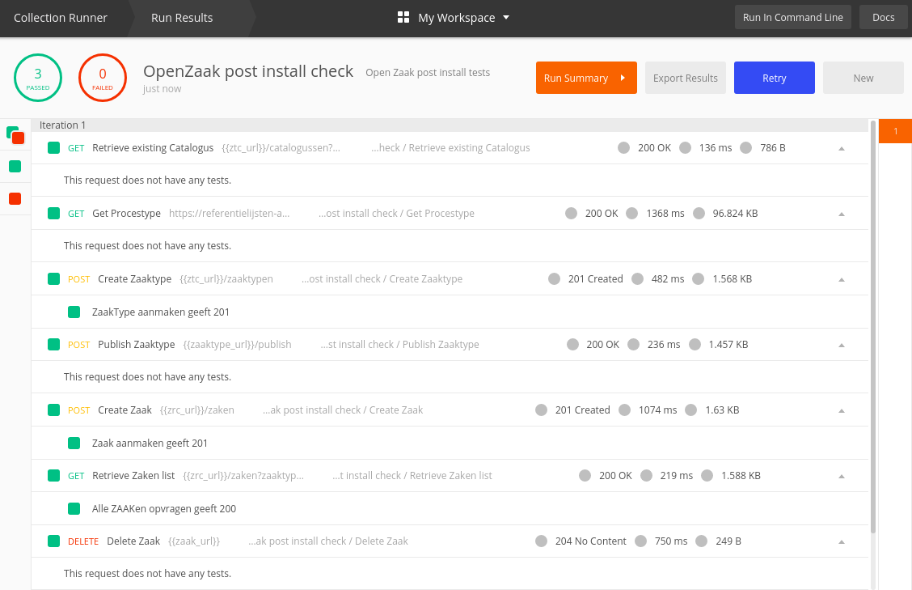

Post-install checklist
======================

After Open Zaak has been installed successfully, go through the following checklist
to see if the software works as expected:

**Check configuration**

Check the configuration page for Open Zaak, accessible at the url ``https://open-zaak.gemeente.nl/view-config/``.
This page will indicate whether certain settings are properly configured:

.. figure:: assets/openzaak-config.png
    :width: 100%
    :alt: Open Zaak config page

**Run check management commands**

If Sentry was set up for Open Zaak, make sure to run the following command to
ensure that logging to Sentry will work as expected:

.. code-block:: shell

    python src/manage.py raven test

Furthermore, to verify that notifications can be received by the URL as defined
in the configuration, send a test notification using the following command:

.. code-block:: shell

    python src/manage.py send_test_notification

.. note:: The notification is sent to the ``test`` channel - make sure it exists in the
   Notificaties API you're using!

**Run the Postman collection**

Finally, run a simple Postman collection on the new install of Open Zaak:

* Create an ``Applicatie`` with superuser permissions via the admin
* A simple Postman collection has been published `here`_, click on the ``Run in Postman`` button
  in the top right.
* Once the collection is loaded into Postman, click the icon in the top right to manage environments:

* Then click ``Add``, enter the correct environment variables, then click ``Update``:

* Click on the ``Runner`` button in the top left of the screen, then select the
  imported collection and the created environment and click ``Run``

* If Open Zaak is properly configured, the tests will pass

.. _`here`: https://documenter.getpostman.com/view/7083537/SWT8gKYU?version=latest
