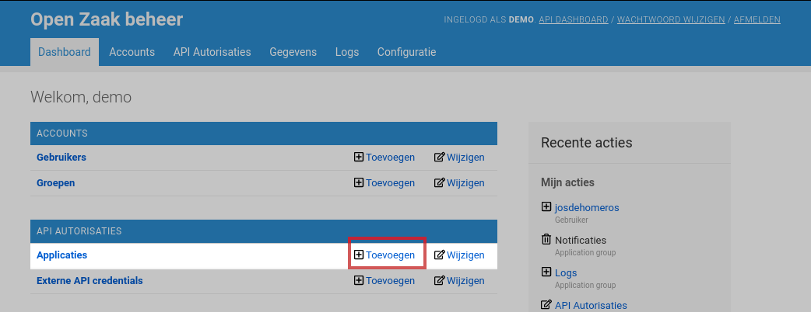
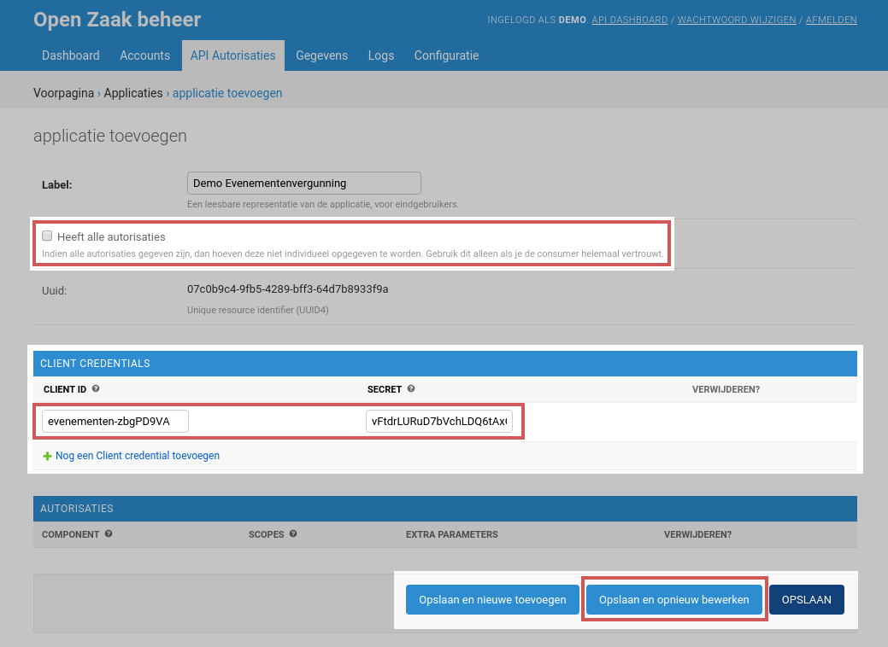
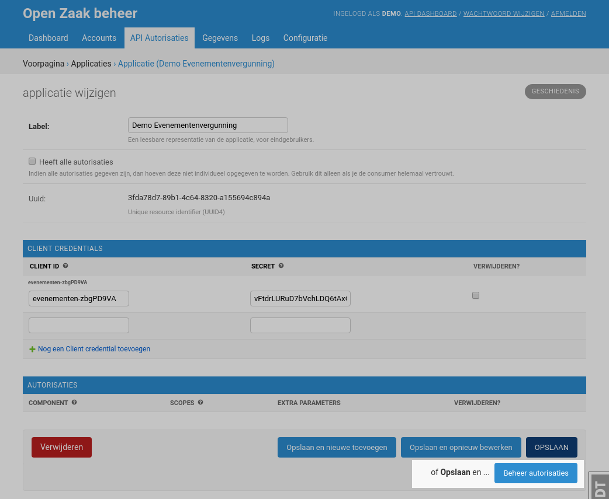
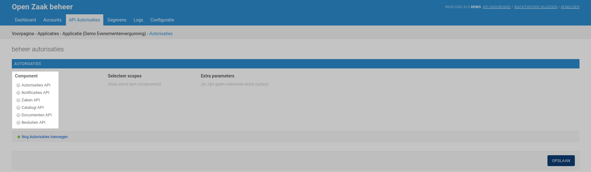
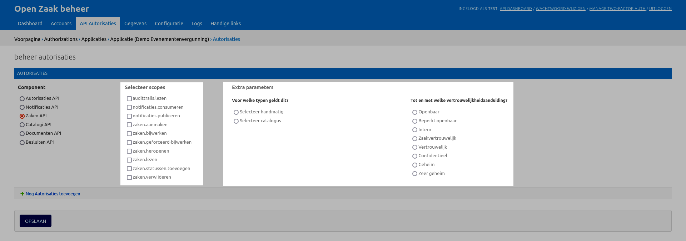
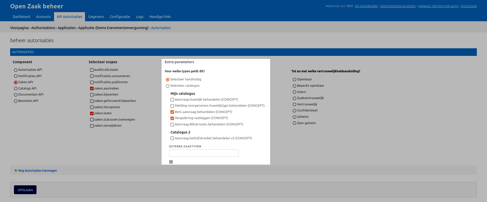

.. _manual_api_auth:

==================
API-toegang beheer
==================

Open Zaak biedt API's aan voor zaakgericht werken. Deze API's zijn niet toegankelijk
zonder authenticatie en autorisatie - gegevens worden namelijk correct beveiligd.
Eindgebruikers maken gebruik van (taak)applicaties, en het zijn deze applicaties die
gebruik maken van de API's voor zaakgericht werken.

Voordat een applicatie dus gegevens kan opvragen, opvoeren, bewerken of vernietigen,
moet deze applicatie hiervoor bekend zijn en geautoriseerd zijn.

Elke applicatie die aangesloten wordt op Open Zaak krijgt authenticatiegegevens.
Tegelijkertijd worden autorisaties ingesteld per applicatie. Autorisatiebeheerders
dienen vervolgens de applicatie-authenticatiegegevens te communiceren naar de
beheerder(s) van de (taak)applicatie.

.. warning::
    De applicaties/authenticatiegegevens die hier beheerd worden, zijn **niet**
    geschikt voor eindgebruikers, maar enkel voor server-to-server communicatie.

.. note:: Om API-toegang te kunnen beheren moet je tot de **API admin**
   groep behoren of equivalente permissies hebben. Zie
   :ref:`manual_users_groups` voor groepenbeheer.

.. _manual_api_auth_applicaties:

Een Applicatie registreren
==========================

Klik op het dashboard onder de groep **API Autorisaties** op de link **Toevoegen**
naast de kop **Applicaties**:

Vul vervolgens het formulier in:

Het **label** is een vriendelijke naam voor de applicatie waarmee je kan herkennen om
welke applicatie binnen je organisatie het gaat. Je kan dit vrij kiezen.

Het vinkje **Heeft alle autorisaties** laat je toe om snel een applicatie alle mogelijke
rechten te geven. Merk op dat dit bijna altijd betekent dat een applicatie meer mag dan
nodig is!

Zorg ervoor dat je minstens één combinatie van *Client ID* en *Secret*
`genereert <https://passwordsgenerator.net/>`_. De applicatie heeft deze gegevens nodig
om tokens te kunnen genereren - communiceer deze dus op een veilige manier naar de
beheerder van de (taak)applicatie.

Klik tot slot op **Opslaan en opnieuw bewerken**, waarna je de
:ref:`autorisaties in kan stellen <manual_api_app_auth>`.

.. _manual_api_app_auth:

Instellen van de API-toegang voor een Applicatie
================================================

Je kan de applicatie waarvan je autorisaties wenst in te stellen bereiken via het
:ref:`lijstoverzicht <manual_general_list>` of vlak na het
:ref:`registreren <manual_api_auth_applicaties>` van een nieuwe applicatie.

Klik rechtsonderin op **Beheer autorisaties** om de autorisaties van een applicatie
in te stellen.

Autorisaties zijn van toepassing op een bepaalde API-component. Eén applicatie kan
zonder problemen autorisaties hebben op een set van componenten.

Componentkeuze
--------------

Kies in de eerste stap voor welke **component** je autorisaties wil instellen:

Afhankelijk van de keuze van de component gebeuren nu een aantal dingen:

* de relevante *scopes* worden nu getoond
* eventuele extra keuzeparameters zijn beschikbaar

Keuze scopes
------------

*Scopes* bepalen welke acties een applicatie via de API kan uitvoeren. Het is een
groepering van rechten.

De betekenis van de scopes is gedocumenteerd per component:

* `Zaken API <https://zaken-api.vng.cloud/ref/scopes/>`_
* `Documenten API <https://documenten-api.vng.cloud/ref/scopes/>`_
* `Catalogi API <https://catalogi-api.vng.cloud/ref/scopes/>`_
* `Besluiten API <https://besluiten-api.vng.cloud/ref/scopes/>`_
* `Notificaties API <https://notificaties-api.vng.cloud/ref/scopes/>`_
* `Autorisaties API <https://autorisaties-api.vng.cloud/ref/scopes/>`_

Typisch zal een leverancier van de applicatie je vertellen welke scopes er precies nodig
zijn. Selecteer de relevante scopes door de checkboxes aan te vinken.

Keuze relevante typen
---------------------

Voor de *Zaken API*, *Documenten API* en *Besluiten API* worden de autorisaties
ingericht per *type* - Zaaktype, Informatieobjecttype en Besluittype respectievelijk.

De type-selectie heeft drie mogelijke opties:

Alle huidige \*typen:
    Dit selecteert alle huidige typen, ook de typen die nog niet gepubliceerd zijn. Voor
    de *Zaken API* gelden de autorisaties dan voor alle zaaktypen uit alle catalogi in
    Open Zaak.

Alle huidige en toekomstige \*typen:
    Dit is dezelfde situatie als ``Alle huidige *typen``, met het verschil dat \*typen
    die aangemaakt worden *na* het instellen van de autorisaties hier ook binnen vallen.

Selecteer handmatig:
    Bij handmatige selectie worden alle \*typen per catalogus opgelijst. Kies de relevante
    \*typen aan door het vinkje aan te zetten.

Keuze vertrouwelijkheidaanduiding
---------------------------------

Tot slot kan je limiteren tot welke vertrouwelijkheidaanduiding een applicatie toegang
heeft. Documenten en Zaken worden aangemaakt met een bepaalde
vertrouwelijkheidaanduiding. Een applicatie heeft enkel toegang tot deze documenten en
zaken waarvan de vertrouwelijkheidaanduiding meer publiek of gelijk-aan de ingestelde
autorisatie-vertrouwelijkheidaanduiding is.

Voor de applicatie lijkt het alsof Documenten en Zaken die *meer* vertrouwelijk zijn
niet bestaan.

.. note::
    Merk op dat de ingestelde vertrouwelijkheidaanduiding van toepassing is op de
    geselecteerde zaaktypen of informatieobjecttypen. Je kan dus een verschillende
    maximale vertrouwelijkheidaanduiding instellen per zaaktype of informatieobjecttype.

Toevoegen extra autorisaties
----------------------------

Linksonderin vind je een link **Nog Autorisaties toevoegen**. Zodra je hierop klikt, ga
je opnieuw door hetzelfde proces om een autorisatie in te stellen. Je kan zoveel
autorisaties instellen als je wenst.

.. warning::
    Let op dat je geen conflicterende autorisaties instelt. Eenmaal een autorisatie voor
    (een groep van) zaaktypen, informatieobjecttypen of besluittypen is ingesteld mag je
    **geen extra** autorisaties voor diezelfde (groep van) zaaktypen,
    informatieobjecttypen of besluittypen meer instellen.

Opslaan wijzigingen
-------------------

Wanneer je klaar bent, vergeet dan niet om rechtsonderin op **Opslaan** te klikken om
de autorisaties te bewaren.
