.. _manual_catalogi_index:

===============
Catalogusbeheer
===============

.. note:: Om catalogussen te kunnen beheren moet je tot de **Catalogi admin**
   groep behoren of equivalente permissies hebben. Zie
   :ref:`manual_users_groups` voor groepenbeheer.

Catalogus aanmaken
==================

Om aan de gang te kunnen met catalogusbeheer moet er eerst een catalogus aangemaakt worden,
klik bij de beginpagina van de admin op **Catalogi** onder het kopje **Gegevens**
en klik vervolgens op de knop **Catalogus toevoegen** rechtsbovenin.

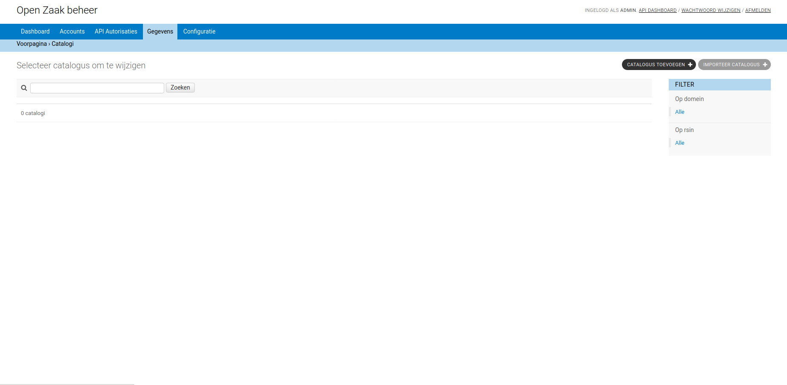

Vul op de volgende pagina minimaal alle dikgedrukte velden in en klik daarna op
de **OPSLAAN** knop rechtsonderin de pagina.

Zaaktype aanmaken
=================

Voeg na het toevoegen van de catalogus een Zaaktype toe aan deze catalogus
door te klikken op **Toon Zaaktypen** onder het kopje **ACTIES**.

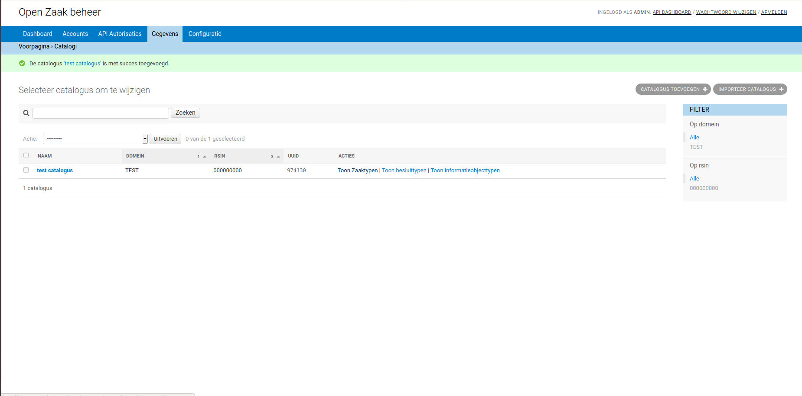

Klik vervolgens op de **Zaaktype toevoegen** knop rechtsbovenin.
Op de volgende pagina is het aan te maken zaaktype al gekoppeld aan de juiste catalogus,
vul de overige verplichte informatie in en sla het zaaktype op door te klikken op de knop
**Opslaan en opnieuw bewerken**, onderaan de pagina.

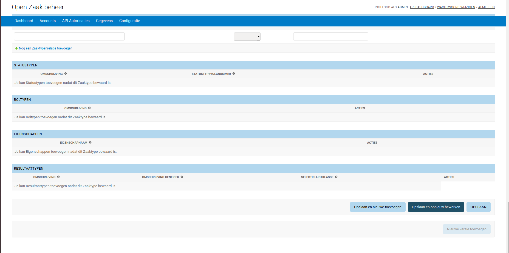

Zaaktype publiceren
===================

Het zojuist aangemaakt zaaktype is nog een concept, wat inhoudt dat dit zaaktype
niet gebruikt kan worden buiten de Catalogi API zelf (er kunnen bijvoorbeeld nog
geen Zaken aangemaakt worden met dit zaaktype). Klik op de **Publiceren** knop
onderaan de detail pagina van het zaaktype om het zaaktype te publiceren.

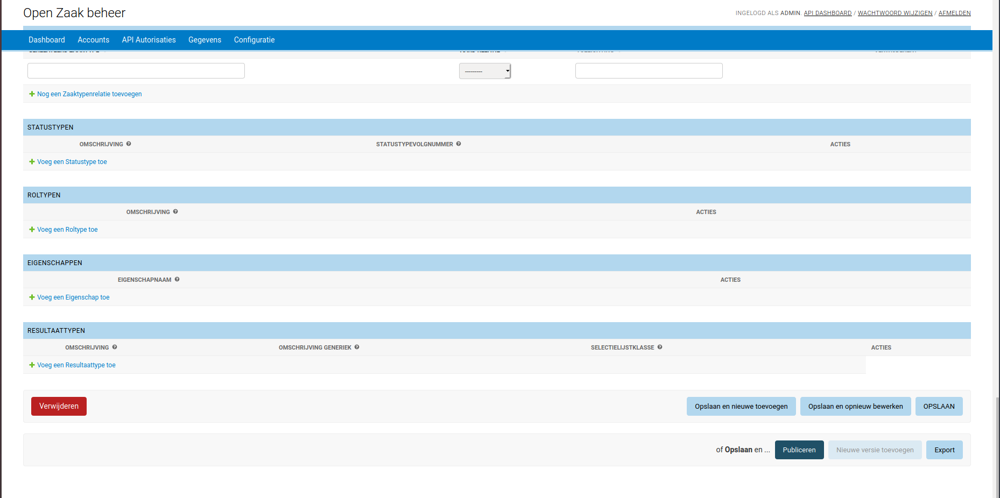

.. note::
    Als je op de detailpagina van het zaaktype aanpassingen maakt en vervolgens
    het zaaktype publiceert, dan worden deze aanpassingen ook opgeslagen.

Een nieuwe versie van een zaaktype aanmaken
===========================================

Om een nieuwe versie van een zaaktype toe te voegen, moet eerst de datum einde
geldigheid van het zaaktype ingevuld worden.

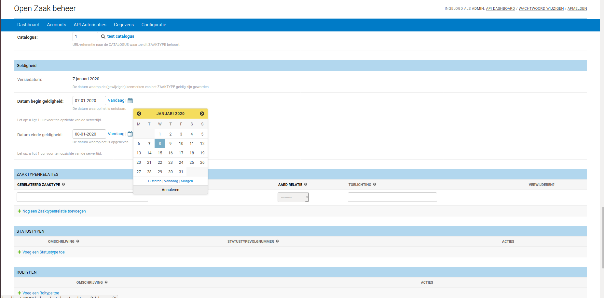

Klik zodra deze datum ingevuld is op de **Nieuwe versie toevoegen**
knop om een nieuwe versie van het zaaktype aan te maken.

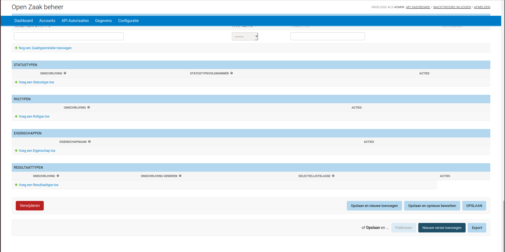

Navigeer vervolgens naar de zaaktypen van de aangemaakte catalogus om de
nieuwe versie te zien. De nieuwe versie zal eerst gepubliceerd moeten worden voor gebruik
buiten de Catalogi API.

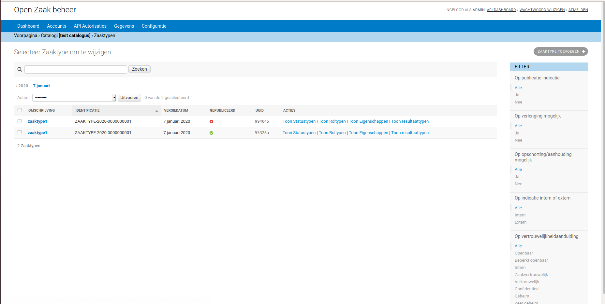

Exporteren/importeren van een catalogus
=======================================

Een catalogus kan samen met alle typen die erin zitten (Zaaktypen, Informatieobjecttype, etc.)
geëxporteerd worden naar een .zip archief, dat vervolgens weer gebruikt kan worden om
de catalogus in een andere Catalogi API te importeren.

Om dit te doen in OpenZaak, klik op de te exporteren catalogus onder **Gegevens** > **Catalogi**
en klik vervolgens op de **Exporteren** knop onderaan de pagina. Download daarna de export als .zip-bestand.

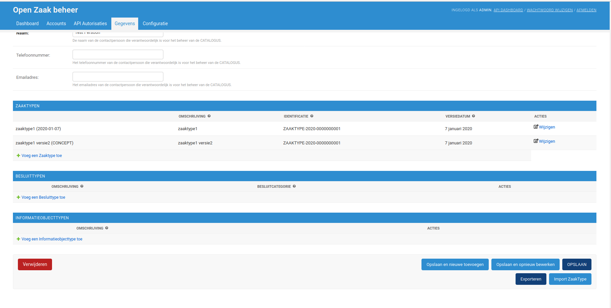

Om de importfunctionaliteit te demonstreren is de zojuist geëxporteerde
catalogus verwijderd uit de OpenZaak admin. Klik hiervoor op
de **Verwijderen** knop linksonderin de detailpagina van de catalogus.

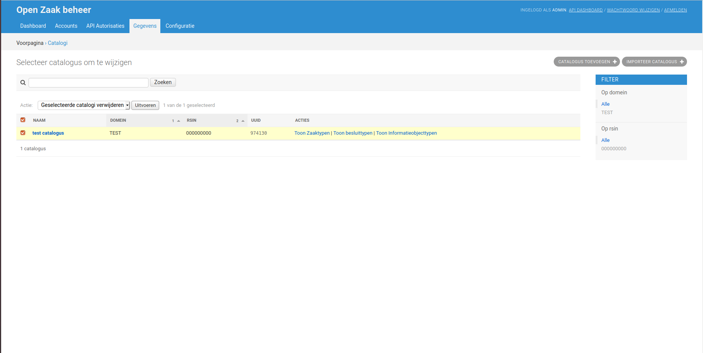

Importeer de catalogus door op de catalogus lijstweergave te klikken op de **Importeer catalogus**
knop rechtsbovenin. Upload op de volgende pagine het .zip-bestand en kies
of er voor de objecten nieuwe UUIDs gegenereerd moeten worden, of dat de bestaande
UUIDs uit de import gebruikt moeten worden.

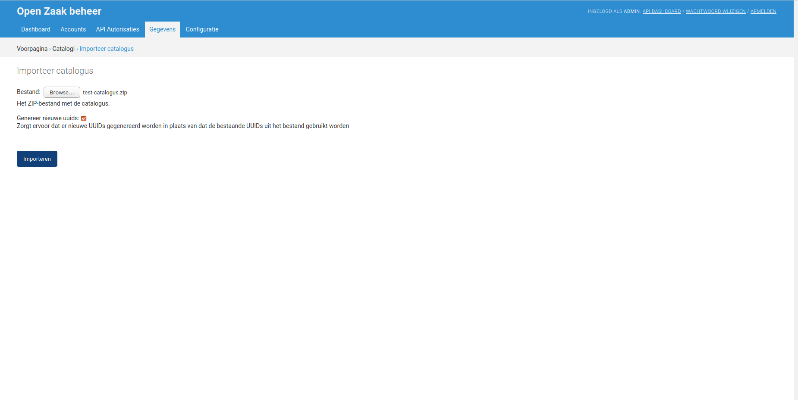

.. warning:: **LET OP**: alle Zaaktypen, Informatieobjecttypen en Besluittypen worden geïmporteerd
   als concept.

Exporteren/importeren van een zaaktype
======================================

In sommige gevallen hoeft niet een gehele catalogus geïmporteerd te worden,
maar alleen een enkel zaaktype uit die catalogus, dit is ook mogelijk in de OpenZaak admin.

Om te demonstreren hoe het importeren werkt als er Informatieobjecttypen en Besluittypen
gerelateerd zijn aan het Zaaktype, worden deze voor deze tutorial eerst toegevoegd aan het zaaktype.
Navigeer hiervoor naar de catalogi lijstweergave, klik op **Toon alle besluittypen**,
klik daarna op **Besluittype toevoegen**, vul de verplichte informatie in en
leg een relatie met het te exporteren zaaktype (hetzelfde geldt voor Informatieobjecttypen).

Exporteer het zaaktype door te klikken op **Export** onderaan de pagina van het zaaktype
en download het .zip-bestand. Om hierna het importeren te demonstreren, wordt dit zaaktype verwijderd door te klikken op
**Verwijderen** linksonderin de zaaktype pagina.

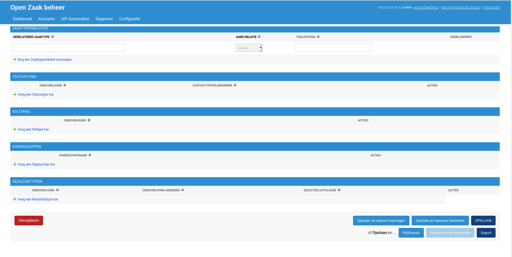

Klik vervolgens de catalogus aan waarin het zaaktype terecht moet komen en druk
op de **Import ZaakType** knop.

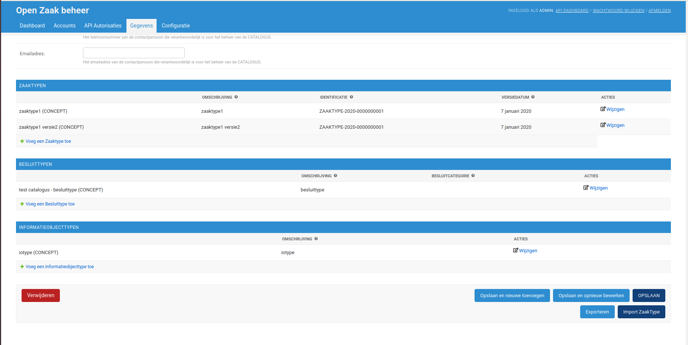

Upload op de volgende pagina het .zip-bestand met de export van het zaaktype

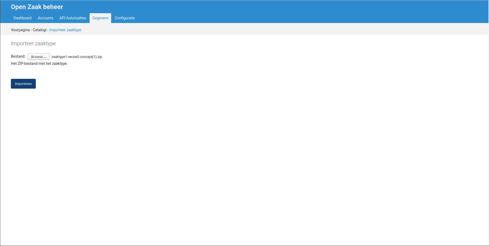

Omdat er in de .zip ook Besluittypen en Informatieobjecttypen zitten, moet er bepaald
worden of deze ook geïmporteerd moeten worden, of dat deze vervangen kunnen worden door
bestaande Besluittypen en Informatieobjecttypen. Aangezien het Besluittype en Informatieobjecttype
in deze tutorial niet zijn verwijderd, wordt er hier voor gekozen om de bestaande typen
te gebruiken. Klik tot slot op **Select** om de import uit te voeren.

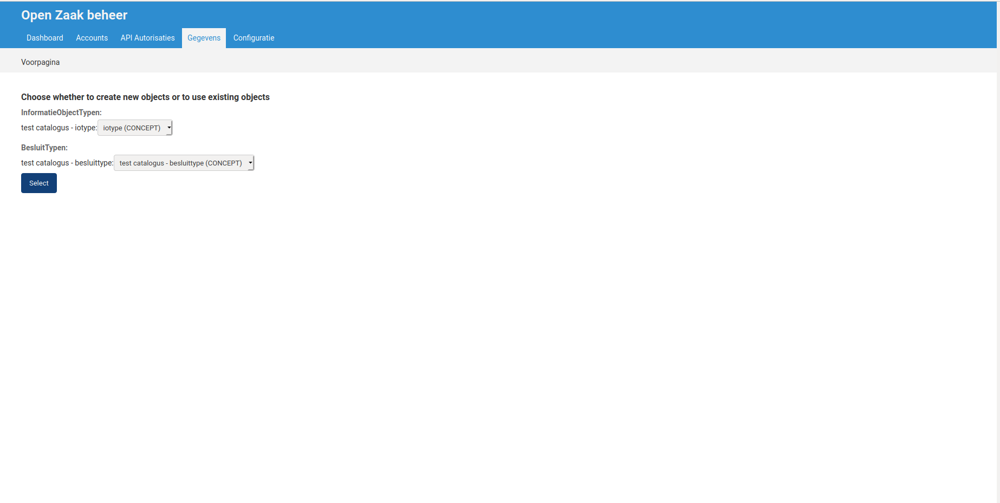
