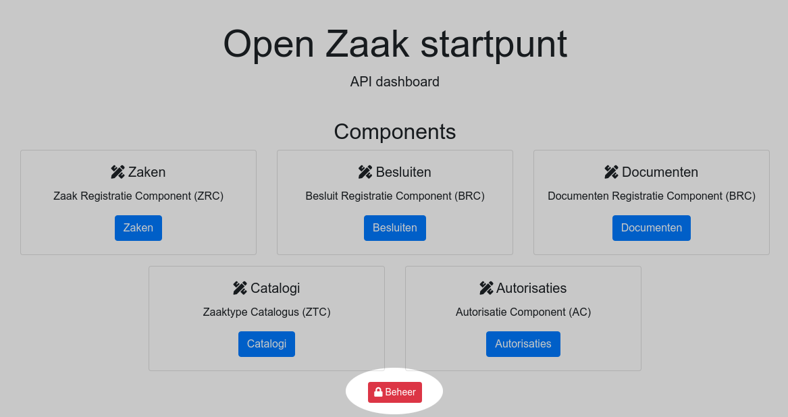
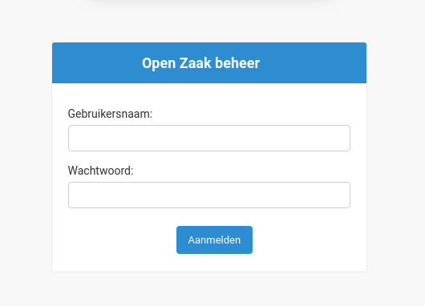
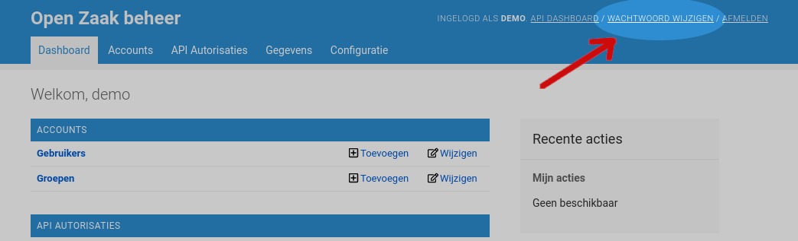
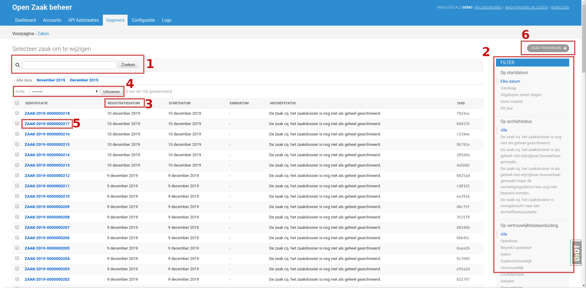
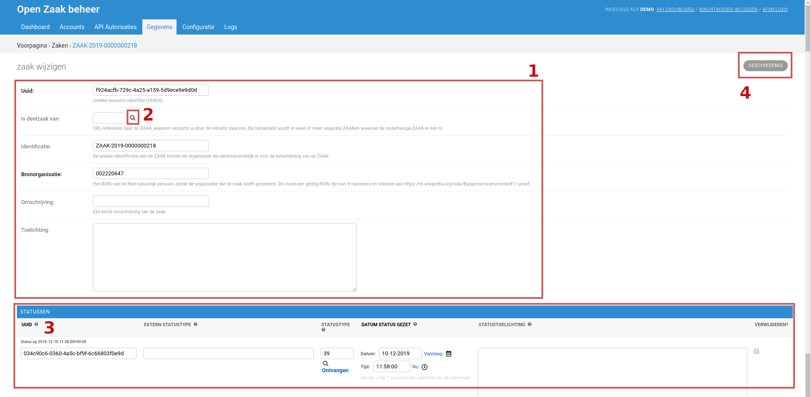

.. _manual_general:

====================
Algemene onderwerpen
====================

De algemene onderwerpen beschrijven acties voor medewerkers met toegang tot de
beheerinterface van Open Zaak (hierna *de admin* genoemd).

In deze handleiding nemen we aan dat Open Zaak geïnstalleerd is en beschikbaar
op het adres https://open-zaak.gemeente.nl.

.. _manual_login:

Inloggen
========

Om in te loggen in de admin kan je navigeren naar de startpagina
https://open-zaak.gemeente.nl. Klik vervolgens op **Beheer**:

Vul je gebruikersnaam en wachtwoord in op het loginscherm:

Na het aanmelden zie je het dashboard. Afhankelijk van je gebruikersrechten
zie je meer of minder items op het dashboard.

Wachtwoord wijzigen
===================

Eenmaal :ref:`ingelogd <manual_login>`, kan je je wachtwoord wijzigen via de
link rechtsboven:

Vul vervolgens je **huidige** wachtwoord in, je **nieuwe** wachtwoord en
je nieuwe wachtwoord ter **bevestiging**.

Klik rechtsonderin op **Mijn wachtwoord wijzigen** om je nieuwe wachtwoord in
te stellen.

.. note::
    Merk op dat er bepaalde regels gelden om een voldoende sterk
    wachtwoord in te stellen. We raden aan om een *password manager* te
    gebruiken om een voldoende sterk wachtwoord in te stellen.

Dashboard
=========

De gegevens die in de admin beheerd kunnen worden, zijn gegroepeerd op het
dashboard. Deze groepen worden hier verder beschreven. Merk
op dat het mogelijk is dat je bepaalde groepen niet ziet omdat je onvoldoende
rechten hebt.

Accounts
--------

**Gebruikers** zijn de personen die in kunnen loggen in de admin. Aan
gebruikers worden rechten toegekend die bepalen wat ze precies kunnen inzien
en/of beheren. Gebruikers kunnen gedeactiveerd worden, waardoor ze niet langer
in kunnen loggen. Ga naar :ref:`manual_users_add` om te leren hoe je een
gebruiker toevoegt en configureert.

**Groepen** definiëren een set van permissies die een gebruiker toelaten om
gegevens in te zien en/of beheren. Een gebruiker kan tot één of meerdere
groepen behoren. Lees meer over groepen :ref:`beheren <manual_users_groups>`.

.. _manual_authorizations:

API Autorisaties
----------------

De *API's voor zaakgericht werken* zijn niet toegankelijk zonder autorisatie.
Dit betekent dat elke applicatie die gegevens ophaalt of registreert in Open
Zaak hiervoor moet geautoriseerd zijn. We spreken van *taakapplicaties*.

Via **Applicaties** wordt elke taakapplicatie geconfigureerd om de toegang in
te regelen. Zie :ref:`manual_api_auth_applicaties` voor hoe je dit doet.

Daarnaast maakt Open Zaak zelf gebruik van andere API's - bijvoorbeeld de
Notificaties API, maar ook externe catalogi, Zaken API's... zijn mogelijk. Via
**Externe API credentials** kan je instellen hoe Open Zaak zichzelf bij deze
API's autoriseert.

Gegevens
--------

De groep *gegevens* laat je toe om gevens in te kijken die via de Open Zaak
API's aangemaakt en/of gewijzigd worden.

**Besluiten** toont de besluiten die ontsloten worden via de *Besluiten API*.

**Catalogi** laat je toe om de (zaaktype)catalogi te beheren. Hoe je dit doet,
is uitgebreid gedocumenteerd in :ref:`manual_catalogi_index`. De gegevens worden
ontsloten met de *Catalogi API*.

**Documenten** laat je toe om informatieobjecten en gerelateerde objecten in te
kijken en beheren. Deze worden via de *Documenten API* aangemaakt en gewijzigd.

**Zaken** bevat alle informatie die de *Zaken API* ontsluit. Hier kan je
volledige zaakdossiers inkijken.

.. _manual_configuration:

Configuratie
------------

Het configuratiegedeelte dient om de Open Zaak-installatie te configureren.
Typisch wordt dit initieel bij installatie geconfigureerd.

Via **Access attempts** en **Access logs** kan je de inlogpogingen en sessies
in de admin van gebruikers bekijken. Deze worden gelogd om *brute-forcing*
tegen te kunnen gaan en inzicht te verschaffen in wie op welk moment toegang
had tot het systeem.

In de **Notificatiescomponentconfiguratie** kan je instellen van welke
*Notificaties API* je gebruik maakt. Je moet een geldige configuratie instellen,
anders worden er door Open Zaak geen notificaties verstuurd.

**Webhook subscriptions** bevat de abonnementen die Open Zaak afneemt bij de
*Notificaties API*. Indien je geen gebruik maakt van de *Autorisaties API* van
Open Zaak, maar een externe API, dan moet je een abonnement afnemen op het
``autorisaties`` kanaal.

**Websites** bevat gegevens over waar Open Zaak gehost wordt. Zorg ervoor dat
de standaard website het juiste domein ingesteld heeft (en dus niet
``example.com``).

Logs
----

Er worden vaak informatieve logberichten weggeschreven die kunnen wijzen op een
probleem in de Open Zaak applicatie. Deze worden via de logs inzichtelijk
gemaakt.

**Failed notifications** toont de notificaties die Open Zaak probeerde te
versturen, maar om één of andere reden niet slaagden. Je kan hier manueel
notificaties opnieuw versturen of verder onderzoeken waarom de notificatie niet
kon verstuurd worden.

**Logging** bevat generieke logberichten die meer informatie kunnen verschaffen
over mogelijke foutsituaties.

Lijst- en detailweergaves
=========================

De structuur van de admin volgt voor het grootste deel hetzelfde patroon:

1. Vertrek vanaf het dashboard
2. Klik een onderwerp aan binnen een groep, bijvoorbeeld *Zaken*
3. Vervolgens zie je een lijst van gegevens
4. Na het doorklikken op één item op de lijst zie je een detailweergave

We gaan nu dieper in op wat je kan in lijst- en detailweergaves.

.. _manual_general_list:

Lijstweergave
-------------

Als voorbeeld zie je de lijstweergave van *Zaken*:

1. De meeste lijstweergaves hebben een zoekveld waarmee je de lijst van
   gegevens kan doorzoeken. Vaak zoeken deze op identificatie, UUID of een
   ander karakteristiek attribuut.

2. Aan de rechterzijde is er meestal een set aan filters beschikbaar. Deze
   laten je toe om snel de resultaatset te reduceren. Filters kunnen
   gecombineerd worden (combinaties werken als EN-filter). Filteren op
   ``startdatum: vandaag`` en ``vertrouwelijkheidaanduiding: openbaar`` toont
   je alle zaken die vandaag gestart zijn EN de vertrouwelijkheidaanduiding
   "openbaar" hebben.

3. Kolommen zijn sorteerbaar - klik op het kolomhoofd om oplopend te sorteren.
   Klik een tweede keer om aflopend te sorteren. Je kan sorteren op meerdere
   kolommen - er verschijnt dan een nummer die aangeeft op welke kolommen er
   in welke volgorde gesorteerd wordt.

4. In de lijstweergave zijn *bulk acties* beschikbaar. Selecteer de objecten
   waarop je de bulk actie wil toepassen door het vinkje links aan te vinken.
   Kies vervolgens in de dropdown te actie die je uit wil voeren.

   .. warning:: Merk op dat het verwijderen van objecten deze objecten ook echt
      **permanent** verwijdert! Het is zelden nodig om objecten te verwijderen.

5. Typisch is de eerste kolom in een lijstweergave een klikbare link. Door deze
   aan te klikken ga je naar de :ref:`manual_general_detailview` van dat object.

6. Rechtsboven heb je typisch een knop om nieuwe objecten toe te voegen. Deze
   opent een formulier om de objectgegevens in te vullen.

.. _manual_general_detailview:

Detailweergave
--------------

In de detailweergave zie je de gegevens/attributen van één enkel object, al
dan niet aangevuld met de gerelateerde objecten.

Als voorbeeld zie je (een deel van) de detailweergave van een zaak:

1. De attributen van de zaak worden opgelijst als bewerkbare velden. Sommige
   attributen zullen niet bewerkbaar zijn, en als je geen bewerkrechten hebt
   zie je alles als alleen-lezen. Verplichte velden worden in het vet gedrukt,
   terwijl optionele velden normaal gedrukt zijn. Indien beschikbaar, dan wordt
   onder het veld een extra helptekst getoond die meer context geeft over de
   betekenis van een veld.

2. Gerelateerde objecten worden vaak via een vergrootglas ingesteld. Wanneer je
   het icoon aanklikt, dan wordt er een lijstscherm geladen waarin je het
   gerelateerde object kan selecteren. Na selectie staat het database-ID
   ingevuld in het veld.

3. Gerelateerde objecten worden *inline* getoond. Zo zul je bij een zaak een
   aantal inlines zien: statussen, zaakobjecten, zaakinformatieobjecten...
   Dit zijn allemaal relaties aan deze specifieke zaak.

4. Je kan de geschiedenis inkijken van een specifiek object. Dit toont de
   wijzigingen aangebracht via de admin interface en door wie *en* de audit log
   van wijzigingen die via de API gebeurd zijn.

Wanneer je helemaal naar beneden scrollt (en de juiste rechten hebt), dan zie
je links onderin ook een knop **Verwijderen**. Hierop klikken brengt je naar
een bevestigingsscherm. In dit scherm worden alle gerelateerde objecten
getoond die mee zullen verwijderd worden.

.. warning:: Verwijderen van objecten is permanent! Eenmaal je de verwijdering
   bevestigt kan dit **niet** meer teruggedraaid worden.
