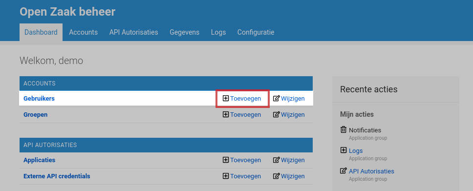
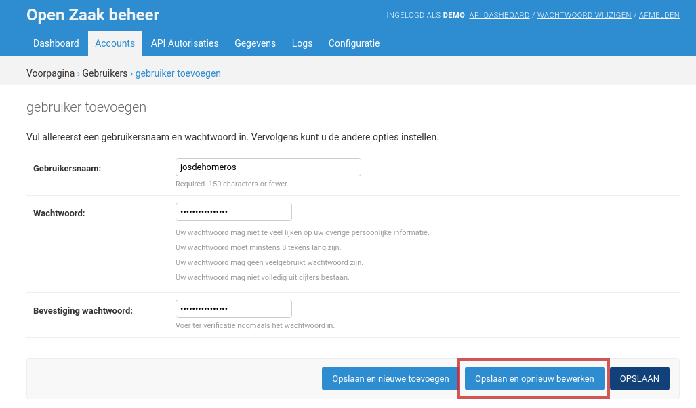
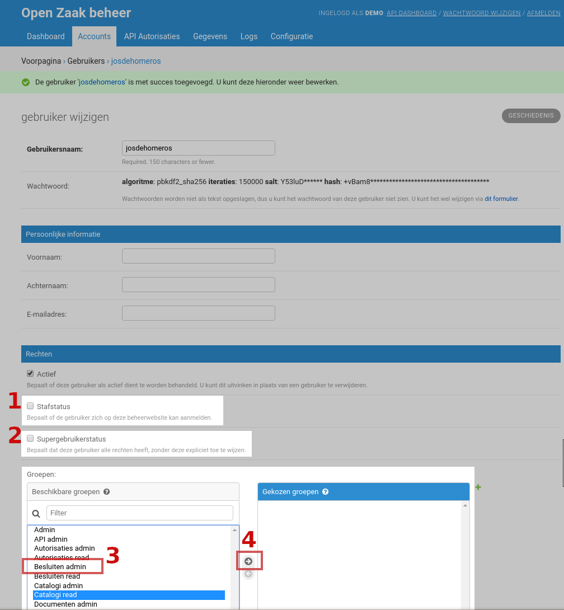

.. _manual_users:

=================
Gebruikerstoegang
=================

.. note:: Om gebruikers te kunnen beheren moet je tot de **User admin**
   groep behoren of equivalente permissies hebben. Zie
   :ref:`manual_users_groups` voor groepenbeheer.

.. _manual_users_groups:

Groepen
=======

Een *groep* is een set van permissies. Een permissie laat een gebruiker toe om
iets te doen. Typisch zijn er vier soorten permissies voor een soort van
gegeven:

* objecten lezen
* objecten aanmaken
* objecten aanpassen
* objecten verwijderen

Een gebruiker kan tot meerdere groepen behoren - de permissies vullen elkaar
dan aan, d.w.z. dat je de gecombineerde set van permissies krijgt van elke
groep.

Een standaard Open Zaak installatie komt met een aantal standaardgroepen:

**Admin**
    Een beheerder die alles kan. Ga hier erg zorgvuldig mee om!

**API admin**
    Leden van deze groep kunnen taakapplicaties en hun API-toegang instellen,
    en Open Zaak configureren om andere API's te consumeren.

**Autorisaties admin**
    Leden van deze groep kunnen taakapplicaties en hun API-toegang instellen,
    en Open Zaak configureren om andere API's te consumeren.

**Autorisaties lezen**
    Leden van deze groep kunnen zien welke applicaties toegang hebben tot de
    Open Zaak API's, maar deze niet bewerken.

**Besluiten admin**
    Leden van de groep kunnen de resources ontsloten via de *Besluiten API*
    lezen, aanmaken en bewerken:

    * Besluiten
    * Relaties tussen besluiten en documenten

**Besluiten lezen**
    Leden van de groep kunnen de resources ontsloten via de *Besluiten API*
    lezen.

**Catalogi admin**
    Leden van de groep kunnen de resources ontsloten via de *Catalogi API*
    lezen, aanmaken en bewerken:

    * Catalogi
    * Zaaktypen
    * Statustypen
    * Resultaattypen
    * Eigenschappen
    * Roltypen
    * Informatieobjecttypen
    * Besluittypen
    * Zaaktype-informatieobjecttypen

**Catalogi lezen**
    Leden van de groep kunnen de resources ontsloten via de *Catalogi API*
    lezen.

**Documenten admin**
    Leden van de groep kunnen de resources ontsloten via de *Documenten API*
    lezen, aanmaken en bewerken:

    * Enkelvoudige informatieobjecten (= documenten) met versiehistorie
    * Gebruiksrechten van documenten
    * Relaties tussen documenten en andere objecten

**Documenten lezen**
    Leden van de groep kunnen de resources ontsloten via de *Documenten API*
    lezen.

**Zaken admin**
    Leden van de groep kunnen de resources ontsloten via de *Zaken API*
    lezen, aanmaken en bewerken:

    * Zaken
    * Statussen van zaken
    * Resultaat van zaken
    * Eigenschappen van zaken
    * Documenten bij zaken
    * Andere objecten bij zaken
    * Klantcontacten van zaken
    * Betrokkenen bij zaken
    * Relevante zaak-relaties

**Zaken lezen**
    Leden van de groep kunnen de resources ontsloten via de *Zaken API*
    lezen.

.. _manual_users_add:

Een gebruiker aanmaken (en aan een groep toevoegen)
===================================================

Vertrek vanaf de startpagina en vind de groep **Accounts**. Klik vervolgens op
**Toevoegen** naast de titel **Gebruikers**:

Vul vervolgens een **gebruikersnaam** in en een **wachtwoord**. Vergeet niet om het
wachtwoord te **bevestigen**. Merk op dat er wachtwoordsterkte-regels gelden!

.. note:: Gebruikersnamen zijn hoofdlettergevoelig!

Klik vervolgens op **Opslaan en opnieuw bewerken**:

In het volgende scherm kan je vervolgens de rechten voor deze gebruiker instellen.

1. Het vinkje *Stafstatus* bepaalt of de gebruiker in kan loggen op de admin-omgeving.
2. Het vinkje *Supergebruikerstatus* geeft aan of de gebruiker altijd alle permissies
   heeft. We raden sterk aan om hier conservatief mee om te gaan.
3. De :ref:`beschikbare groepen <manual_users_groups>` staan opgelijst in de
   linkerkolom. Om een gebruiker aan een groep toe te wijzen selecteer je de groep
   door deze aan te klikken en op de pijl naar rechts (**4**) te klikken. Je kan
   meerdere groepen in één keer toekennen door de ``CTRL``-toets ingedrukt te houden
   tijdens het aanklikken. Je kan ook dubbelklikken om een groep toe te kennen.

Klik rechtsonder op **Opslaan** om de wijzigingen door te voeren.
